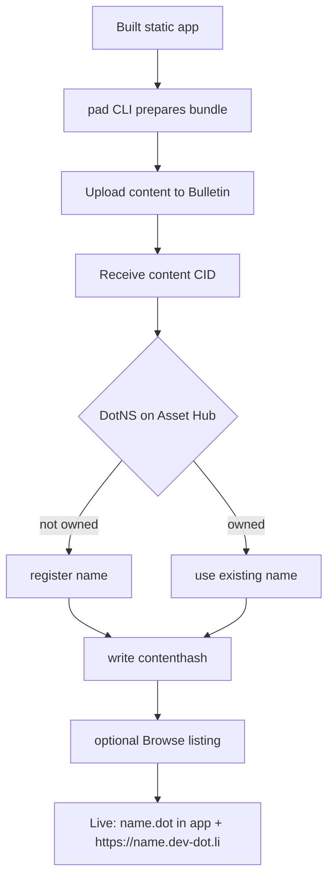
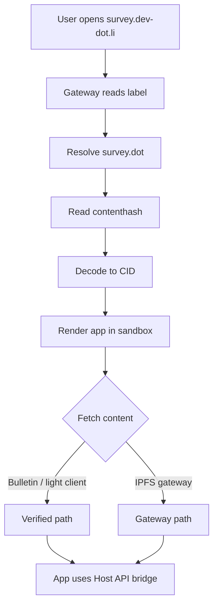

# App delivery

This page follows a built frontend as it becomes a live app on the Polkadot
Products Devnet. The path is concrete: publish a static bundle with the `pad`
CLI, store the content on the Bulletin chain, bind a `.dot` domain to it, and load
it through the `dev-dot.li` gateway or the Polkadot app.

App delivery is deliberately layered so that no single server sits between a user
and an app. Content lives on-chain (Bulletin), the pointer to it lives on-chain
(a `.dot` domain resolver on Asset Hub), and the loader is a client-side program
that reads both directly.

## The two pipelines at a glance

Delivery has a write side (publishing) and a read side (opening). The publisher
uploads a bundle and binds a name to it once; every visitor then resolves and
fetches that bundle independently.



## Publishing with `pad`

The deploy CLI is [`@parity/polkadot-app-deploy`](https://www.npmjs.com/package/@parity/polkadot-app-deploy),
which ships the `pad` binary (alongside `polkadot-app-deploy` and
`polkadot-app-bootstrap`). `pad` selects a network with `--env devnet`. After
building your frontend, a publish is a single invocation over the output
directory:

```bash
npm i -g @parity/polkadot-app-deploy
pad ./dist my-app.dot --env devnet
```

The CLI merkleizes the build directory into a content-addressed DAG-PB archive,
chunks it (~2 MiB) and uploads the blocks to Bulletin via
`TransactionStorage.store_with_cid_config`, then writes the resulting root CID
as an ENS-style `contenthash` (`0xe301` + CIDv1) into the DotNS
`ContentResolver` on Asset Hub. Re-publishing the same app skips unchanged
blocks and updates the name to point at the new content.

### Bulletin storage and upload authorization

Content is stored on the Bulletin chain. Uploads are authorization-based rather
than fee-based: the deploy account needs upload quota, but does not pay devnet
tokens for each bundle. Quota is granted by the network's **authorizer** (an
operator role) via `authorize_account`; a publisher cannot self-authorize. On the
devnet you request authorization for your deploy account from the operators, and
can inspect it in the [Bulletin Chain Console](https://paritytech.github.io/polkadot-bulletin-chain/authorizations).
See [Get storage authorization](../guides/build-and-publish.md#get-storage-authorization)
for the practical steps. This is separate from the token
[faucet](https://faucet.polkadot.io), which only provides native tokens for fees.

!!! note
    Authorizations are finite and expire. If a previously working deploy
    account starts failing at the upload step, its authorization likely lapsed
    and must be refreshed before uploads resume.

### Binding the `.dot` domain

Once the content CID exists, the CLI checks whether the signer owns the `.dot`
name. If the name is available, it can register it; if the signer already owns
it, the CLI updates the name's content hash. That single on-chain record is what
turns a name into an app. See [Naming (DotNS)](naming.md) for how ownership and
resolution fit together.

Optionally, `--publish` calls `Publisher.publish(label)` so directory apps such
as Browse can enumerate your app; it is silently skipped on networks that have
no Publisher contract configured. See [App discovery (Browse)](discovery.md).

!!! tip
    A deploy config can also publish manifest records. Product apps use those
    records to describe executables, labels, and icons to the host.

## Opening an app through the gateway

The web gateway at [https://dev-dot.li](https://dev-dot.li) is a client-side
loader. There is no resolution server: the host shell reads the label from the
subdomain, resolves it, fetches the content, and renders it in a sandboxed
iframe.



The rendered app talks to the host through a bridge for accounts, signing, chain
connection, and scoped storage. From the user's perspective, the same name works
in both places: on the web it is `https://<label>.dev-dot.li`, and in the
Polkadot app it is `<label>.dot`.

## Common blockers

- **Upload fails.** The deploy account may need Bulletin storage authorization.
- **The name cannot be updated.** The signer must own the `.dot` domain.
- **The app opens but has stale content.** Confirm the name's content hash points
  to the latest CID and that the gateway is resolving the expected network.
- **The app is live but hard to find.** Use `--publish` so Browse can list it.

## Learn more

- [polkadot-app-deploy](https://github.com/paritytech/polkadot-app-deploy) — source for the `pad` CLI
- [dotli-community](https://github.com/paritytech/dotli-community) — the gateway loader
- [Build & publish a dApp](../guides/build-and-publish.md) — do it
