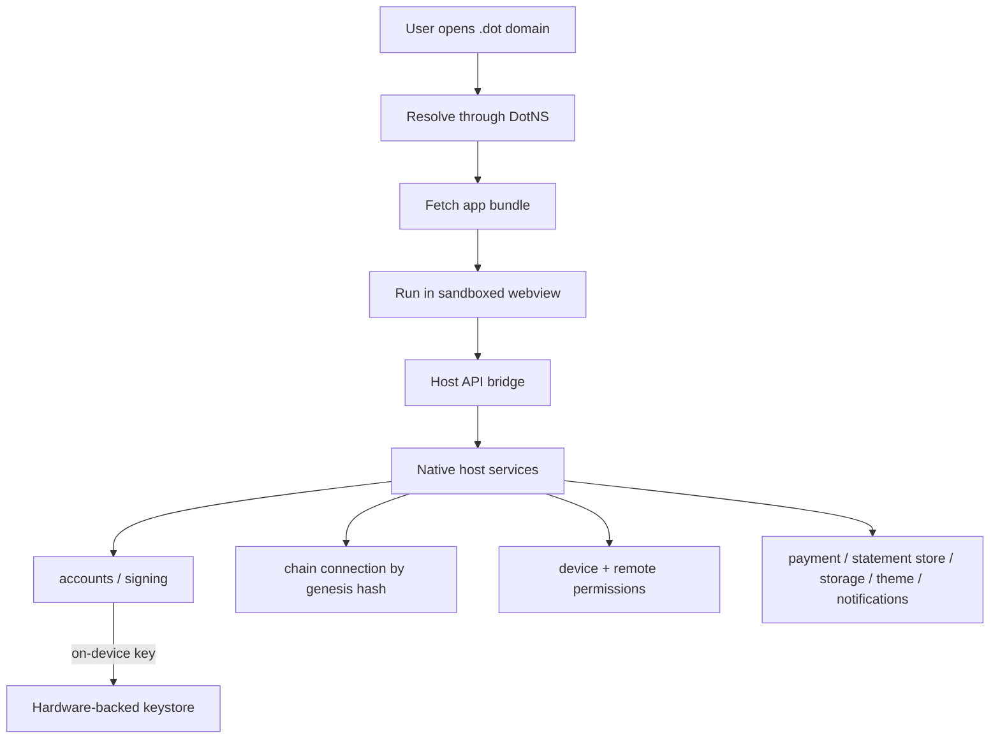
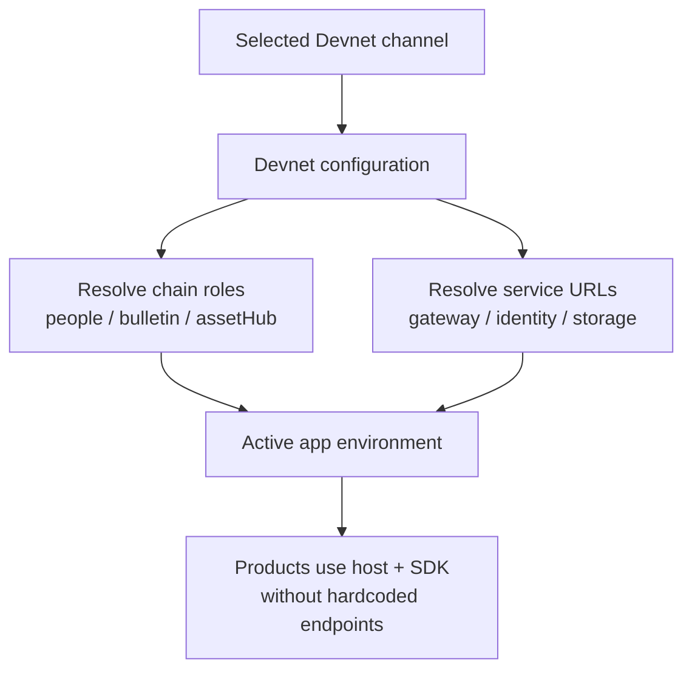

# The Polkadot app (client tier)

The Polkadot app is the end-user entry point to the Polkadot Products Devnet.
It keeps keys on the user's device and combines identity, chat, payments, and an
in-app browser for `.dot` apps. This page describes the client tier across
mobile and desktop, how apps run inside it through the Host API, and how the app
decides which network it is talking to.

## What the client tier helps you do

The client tier gives users one place to hold keys, manage identity, use CASH,
message other people, and open `.dot` apps. For developers, it provides the host
environment that Product apps rely on for accounts, signing, chain access,
permissions, and storage.

The product surface is shared across native clients:

| Client | Role |
|--------|------|
| Polkadot Android | Mobile app with local custody, identity, CASH, messaging, and app hosting |
| Polkadot iOS | Mobile app with the same product surface for iOS users |
| Polkadot Desktop/Web | Desktop app and web client for the same account and Product flows |

The Desktop build also runs as a web application, and the same product suite is
reachable through the web gateway at [dev-dot.li](https://dev-dot.li). Download
links are in [More resources](../reference/resources.md).

## Wallet and account management

On mobile (Android, iOS), accounts are created and stored on-device and the app is
self-custodial. Keys are held in the platform's hardware-backed secure storage (the
Android keystore, or the iOS Keychain), and recovery is offered through the device's
cloud backup (Google Drive on Android, iCloud on iOS). On mobile, signing happens
locally: when a dApp or an in-app action needs a signature, the app presents a modal, and
only on your approval does the on-device key sign the payload.

The desktop/web client holds no keys of its own. It is a companion: you pair it with your
phone (scan a pairing code) and signing happens on the phone. Nothing funds a brand-new
account automatically. On devnet (non-production) builds you can top up your account with
test tokens using the manual "+" (top-up) action; for native devnet tokens to pay
transaction fees you can also use the faucet at <https://faucet.polkadot.io>.

The identity, chat, and payment features map onto specific parachains: the People Chain
carries your username and the chat statement store, Asset Hub carries payments and the
DotNS name registry, and the Bulletin Chain serves dApp content and chat attachments.

## The app browser and the client layers

The in-app browser addresses dApps by `.dot` domain rather than by URL. A name is
resolved through DotNS, the referenced content archive is fetched from Bulletin
or a gateway, and the archive runs inside a sandboxed webview. The app injects a
Host API bridge so Products can ask the host for account, signing, chain,
permission, storage, theme, notification, payment, and navigation services.

Each platform implements the webview and bridge in its native stack, but the
contract exposed to Products is the same Host API.

## Running dApps through the Host API

Once the webview loads, the Product talks to the host through the injected API.
The host decides which capabilities are available, checks permissions, and
mediates sensitive actions such as signing.

A typical signing flow looks like this:

1. The dApp calls `hostApi.signPayload`, `signRaw`, or `createTransaction` over the
   Spektr channel.
2. The native side receives the request and checks the product's granted permissions.
3. The app shows a signing modal for you to review and approve.
4. On approval the on-device key signs, and the signature is returned to the dApp;
   broadcast is gated inside the container.

!!! tip
    If you are building a product, you rarely call these primitives by hand. The
    [`@parity/product-sdk`](https://www.npmjs.com/package/@parity/product-sdk) layer
    wraps the Host API, and you can test a product end-to-end against a real host with
    [`@parity/host-api-test-sdk`](https://www.npmjs.com/package/@parity/host-api-test-sdk)
    — a Node host that embeds your product in an iframe over the real Spektr protocol,
    injects dev accounts (Alice/Bob), and auto-signs requests.

## Selecting the network

Network selection is operator-driven. Each client asks for the roles it needs
(`people`, `bulletin`, `assetHub`), then receives the current RPC endpoints,
DotNS contract addresses, gateway URLs, and backend URLs from the Devnet
configuration service. The important point for users and app developers is that
the app does not expect Products to hardcode those values.

If the app cannot resolve a complete environment, it fails closed instead of
guessing. Developer tooling follows the same idea: CLIs select a named network
preset, and the preset supplies the chain and registry addresses for that
environment.

## Common blockers

- **A Product runs outside the host.** Host-only APIs need the Polkadot app or
  web gateway. Use the test host for local end-to-end tests.
- **A signing request is denied.** The user must approve locally, and the
  Product must have the required permission.
- **The app cannot resolve the Devnet.** Network configuration is supplied by
  the platform; hardcoded endpoints in Product code are brittle.

## Learn more

- Client source and downloads: [More resources](../reference/resources.md)
- [host-api-test-sdk](https://github.com/paritytech/host-api-test-sdk) — drive a Product against a real host in CI
- [Naming (DotNS)](naming.md) — how the browser resolves a `.dot` domain
