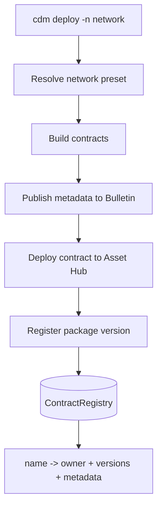
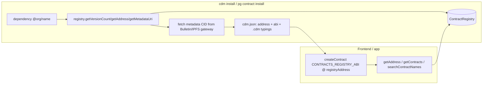

# Smart contracts & CDM

Smart contracts on the Polkadot Products Devnet run on **PolkaVM (PVM)** through
**`pallet-revive`** on Asset Hub. The developer-facing workflow is built around
the **Contract Dependency Manager (CDM)**: you publish a contract under a package
name, and other apps resolve that name to the current address and ABI.

!!! note
    This is a public developer preview. Devnet tokens have no real value, and
    deployed contracts, registry addresses, and flows may change without notice.

## What CDM helps you do

CDM gives Product developers a package-like workflow for contracts:

- **Build** a contract into PolkaVM bytecode.
- **Deploy** it to Asset Hub.
- **Register** it under a package name such as `@org/name`.
- **Resolve** that name later from an app or another package.
- **Install** the ABI and generated TypeScript helpers into a frontend.

The `@parity/product-sdk-contracts` package (part of the
[Product SDK](client.md)) is what applications use at runtime to make typed
calls against these contracts.

## The Contract Registry

Each network has an on-chain **`ContractRegistry`**. For each package name it
stores the owner, published versions, contract addresses, and metadata pointers.

Registration follows a first-writer-owns rule: the first account to publish a
name becomes its owner, and only that owner may publish subsequent versions.
Names must match the `@scope/name` shape, be ASCII, and encode to at most 64 bytes.

The registry address is per network and is resolved by
**`@polkadot-community-foundation/cdm-env`** via `getRegistryAddress(name)`.
Apps should read the address for their selected preset at runtime instead of
copying addresses into source.

!!! warning
    The concrete `--env` name for the live devnet and the registry backing it
    are supplied by the team operating the network. Confirm the address for your
    target network rather than hard-coding a known preset.

## Metadata on the Bulletin Chain

A contract's ABI and documentation are stored as content-addressed metadata on
the **Bulletin Chain**. The registry stores a pointer to that metadata, and
installers fetch it when they need the ABI.

## Deploying and registering

The **`cdm` CLI** drives the full pipeline. A deploy runs, in order:



To deploy your own contracts:

1. Install the CLIs:

    ```bash
    npm i -g @polkadot-community-foundation/cdm-cli
    ```

2. Declare inter-contract dependencies in the project metadata so CDM knows the
   build order.
3. Deploy against your network:

    ```bash
    cdm deploy -n <network>
    ```

4. On a fresh network, the registry must exist before packages can be published.

!!! tip
    Never print or commit signing seeds. Use the network faucet at
    <https://faucet.polkadot.io> to fund a deploy account; some devnet builds
    also auto-fund new accounts.

## Consuming a contract: `cdm install`

Downstream projects do not need the source of a contract — only its name. Running
an install reads the registry, fetches the ABI, and writes a `cdm.json` manifest
plus generated TypeScript augmentation:

```bash
cdm install @org/name
```

The installer reads the registry, fetches the metadata by CID, extracts the ABI,
and writes local generated helpers. The **`playground-cli`** uses the same idea
for playground sessions.

## How a frontend resolves a contract

At runtime an application resolves a name to an address and ABI, then makes
typed calls. The **CDM Frontend** at <https://contracts.dev-dot.li> is a useful
reference for browsing what has been published.



In an installed application, ABIs usually come from `cdm.json` and generated
helpers, while addresses are resolved from the registry for the target network.

## Shared system contracts

The **`contract-developer-tools`** repository contains shared PVM contracts
deployed through CDM. It is a useful reference when you want to see how packages
declare dependencies and consume registry-installed contracts.

## Common blockers

- **The package name is already owned.** First writer owns the name; later
  versions must be published by the owner.
- **The registry address is wrong.** Resolve it from the selected network preset
  instead of copying an address between environments.
- **Metadata cannot be fetched.** Check the Bulletin/IPFS gateway and the CID
  stored for the package version.
- **Deployment account has no funds.** Use the faucet for PAS before deploying.

## Learn more

- CDM source: <https://github.com/paritytech/contract-dependency-manager>
- Shared system contracts: <https://github.com/paritytech/contract-developer-tools>
- playground-cli source: <https://github.com/paritytech/playground-cli>
- `@polkadot-community-foundation/cdm-cli` on npm: <https://www.npmjs.com/package/@polkadot-community-foundation/cdm-cli>
- `@polkadot-community-foundation/cdm-env` on npm: <https://www.npmjs.com/package/@polkadot-community-foundation/cdm-env>
- `@parity/product-sdk-contracts` on npm: <https://www.npmjs.com/package/@parity/product-sdk-contracts>
- CDM Frontend (devnet): <https://contracts.dev-dot.li>
- Polkadot smart contracts documentation: <https://docs.polkadot.com>
