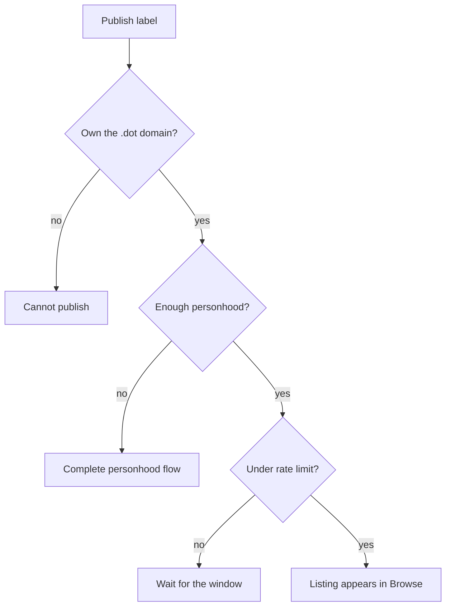
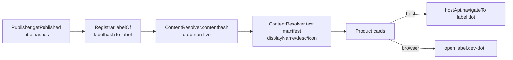

# App discovery: Browse

Browse is the app-discovery directory for the Polkadot Products Devnet. It
answers a practical question — *which `.dot` apps exist, and how do I open
one?* — without turning the directory into the source of truth for app metadata.
The on-chain listing is deliberately small; the user-facing name, description,
and icon are resolved from DotNS records and content storage at read time.

The reference directory runs at [browse.dev-dot.li](https://browse.dev-dot.li). Its source
lives in the source repository
[paritytech/browse](https://github.com/paritytech/browse).

!!! note
    This is a public developer preview. Devnet tokens have no real value, and the
    contracts described here are prototype code that has not been audited. Flows may change.

## What discovery helps you do

Users use Browse to find apps. Developers use it to make a published app
visible after the app already has a `.dot` domain and a bundle. Browse is not a
replacement for DotNS or app delivery; it sits on top of them.

The system has three responsibilities:

- **Registry** — records that a `.dot` label should appear in discovery.
- **Reader SDK** — reads registry entries and joins them with DotNS metadata.
- **Client UI** — renders cards and opens the selected app in the host or web
  gateway.

## What a listing actually holds

A listing is created by publishing a `.dot` label to the Browse registry. The
registry stores only the minimum needed to enumerate apps. It does **not** store
the display name, description, icon, or app bundle.

All display metadata lives off-chain and is joined by labelhash at read time:

- The human-readable label comes from DotNS.
- The app bundle and display metadata come from the name's resolver records.
- The root manifest provides the card content Browse shows to users.

A valid manifest needs a display name, description, and icon:

```json
{
  "$v": 1,
  "displayName": "Simple Survey",
  "description": "Create and answer on-chain surveys.",
  "icon": { "cid": "bafy...", "format": "png" }
}
```

## The publish permission model

Who is allowed to list an app is enforced on-chain:

1. You must own the `.dot` domain.
2. You need the required personhood status for the publish action.
3. You must be under the publish rate limit for your personhood tier.

| Personhood status | Meaning | Publishes per 24h |
|---|---|---|
| None | Not enough to publish | 0 |
| Lite | Basic personhood | 1 |
| Full | Stronger personhood | 5 |

Unpublishing is simpler: if you own the name, you can remove it from Browse.



Listing is not a separate deploy step. The `pad` deploy CLI
([`@parity/polkadot-app-deploy`](https://www.npmjs.com/package/@parity/polkadot-app-deploy))
can call `Publisher.publish(label)` as part of a deploy when you pass `--publish`, right
after it writes the name's contenthash. See
[Delivery: how apps ship](./app-delivery.md) for that pipeline.

## How a listing is consumed

The client builds the directory from the registry every time it loads:

1. **Enumerate** — read published labels from the registry.
2. **Resolve labels** — turn label identifiers back into `.dot` labels.
3. **Hydrate** — read each name's content hash, manifest, and any available
   attestation or certificate data.
4. **Render** — build product cards from `displayName`, `description`, and the icon (fetched
   through the host's preimage manager, not a raw gateway URL), with certificate badges.

Discovery reads do not need a signer and do not send transactions. Opening an
app is a handoff: inside the Polkadot app, Browse asks the host to navigate to
the `.dot` domain; in a browser, it opens the web gateway.



!!! tip
    Because the registry stores only labelhash + publisher + timestamp, re-skinning an app
    (new name, description, or icon) needs no registry write at all — you update the DotNS
    `manifest` record and the directory reflects it on the next hydrate.

## Common blockers

- **The app is deployed but not listed.** Publishing and listing are separate.
  Use `pad --publish` or publish the label through Browse tooling.
- **The app has no card metadata.** Update the DotNS manifest record with a
  display name, description, and icon.
- **The publish call fails.** Check that the signer owns the `.dot` domain and has
  enough personhood for the current rate limit.

## Learn more

- [Browse repository](https://github.com/paritytech/browse)
- [`@parity/polkadot-app-deploy`](https://www.npmjs.com/package/@parity/polkadot-app-deploy) — the `pad` CLI (`--publish`)
- [`@parity/product-sdk`](https://www.npmjs.com/package/@parity/product-sdk) — build an app that gets listed
- [Delivery: how apps ship](./app-delivery.md) — the deploy pipeline that writes the contenthash and manifest
- [Naming with DotNS](./naming.md) — how `.dot` labels, contenthash, and text records work
- [Polkadot developer docs](https://docs.polkadot.com)
