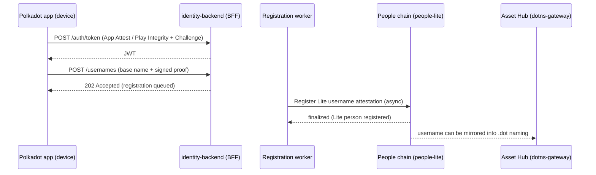
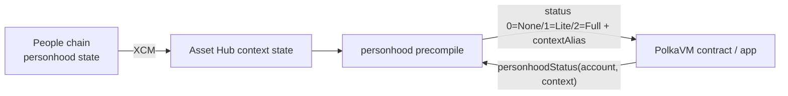

# Identity & personhood

Identity on the Polkadot Products Devnet answers two related questions: *what
name does this account use?* and *does this account represent a distinct
person?* The first is the username flow; the second is proof of personhood. Apps
can use both signals without holding the user's keys or learning a user's
cross-application activity.

!!! note
    This is a public developer preview. Devnet tokens have no real value, and the flows described here may change. No page in these docs prints secrets; the account addresses that operate the backend and bots are supplied at runtime and are intentionally not published here.

## The moving parts

Identity spans a small number of independently deployed components. The main
source repositories are available under [github.com/paritytech](https://github.com/paritytech).

| Component | Role | Source |
| --- | --- | --- |
| `identity-backend` | Stateful HTTP backend-for-frontend (BFF) for the Polkadot app, backed by Postgres (usernames, single-use/revocable refresh tokens, a registration queue, device attestations, and invitation tickets). Issues JWT sessions, registers usernames, manages invitation tickets. Holds no user keys. | [identity-backend-community](https://github.com/paritytech/identity-backend-community) |
| `people-lite` pallet | On-chain registry of *Lite* people (attested usernames) on the People chain. | [individuality-community](https://github.com/paritytech/individuality-community) |
| `proof-of-ink` pallet | On-chain *Full* personhood: applications, invitations, and evidence judging. | [individuality-community](https://github.com/paritytech/individuality-community) |
| `personhood` precompile | A pallet-revive precompile that lets any PolkaVM contract read an account's personhood tier and a per-app alias. | [individuality-community](https://github.com/paritytech/individuality-community) |
| `attestation-protocol` | An EAS-style, permissionless attestation suite (`SchemaRegistry` + `AttestationService`) for general claims. | [attestation-protocol](https://github.com/paritytech/attestation-protocol) |

## Sessions: proving the device, not the person

Before a client can register anything, it obtains a JWT through a device-attestation handshake. The backend never sees a password; it verifies that a request comes from a genuine, unmodified instance of the app on a genuine device.

1. The client requests a **Challenge** — a stateless, self-authenticating freshness nonce the server mints with no server-side storage.
2. The client produces an **Attestation**: Apple App Attest on iOS, Google Play Integrity or Android key attestation on Android, or a voucher secret for out-of-band enrolment.
3. The client `POST`s the Attestation and echoed Challenge to `/api/v1/auth/token`, and receives a JWT. `/auth/token/refresh` rotates it.

The important property is that a session proves the device and app instance
before the backend accepts identity actions from it.

## Usernames and the Lite tier

A **Lite** person is an account with an attested, human-readable username. The
client asks for a base name, the backend allocates an available suffixed name,
and the user signs the registration. The backend accepts and queues the request
(returning `202 Accepted`), and a separate worker submits the attestation to the
People chain asynchronously; it does not take custody of the user's keys or sign
as the user.

Registration is not unconditional. On iOS, Apple DeviceCheck limits the number
of free registrations per device: a device that has already registered gets a
`PAYMENT_REQUIRED` response on further attempts.

Each new username can also be reflected into the `.dot` naming system, so the
same human-readable identity works across the app and app-discovery flows. That
mirroring is operator-run infrastructure; users and Product developers normally
do not interact with it directly.



## Full personhood and invitation tickets

The **Full** tier is stronger: it represents a person who has completed a
personhood flow, such as an invitation or game-based proof. The backend can help
users obtain the tickets or proofs needed to start those flows, but the status
itself is recorded on-chain.

!!! warning
    Whether the Full tier is currently active on the deployed devnet depends on operator-privileged tasks (game scheduling and related runtime configuration). Treat a `None`/`Lite` result as the safe default and do not assume Full personhood is available.

## How apps consume identity status

Contracts do not query the backend to check personhood. Personhood state is
reflected from the People chain to Asset Hub, where PolkaVM contracts can read
it through the **personhood precompile**.

```solidity
struct PersonhoodInfo { uint8 status; bytes32 contextAlias; }

// status: 0 = None, 1 = Lite, 2 = Full
function personhoodStatus(address account, bytes32 context)
    external
    view
    returns (PersonhoodInfo memory);
```

The returned `contextAlias` is a per-application, privacy-preserving pseudonym:
the same person yields a different alias in a different context, which prevents
apps from linking a user's activity across applications.



Application front-ends that run inside the Polkadot app or the web gateway at [https://dev-dot.li](https://dev-dot.li) obtain identity and host information through the app's developer packages — [`@parity/product-sdk`](https://www.npmjs.com/package/@parity/product-sdk) and [`@novasamatech/host-api`](https://www.npmjs.com/package/@novasamatech/host-api). The exact surface those packages expose for username and personhood status is defined in their own repositories.

## General attestations

Beyond personhood, the attestation protocol provides reusable claim and schema
contracts for the PolkaVM Asset Hub. Use it when an app needs verifiable claims
that are not the same thing as username or personhood status.

## Common blockers

- **The device session is missing or expired.** The app must complete device
  attestation before identity actions can proceed.
- **The username is taken.** The backend allocates a suffixed available name.
- **Full personhood is not available in a build.** Treat `None` or `Lite` as the
  safe default unless the current Devnet flow exposes Full.
- **An app needs identity in a contract.** Read personhood through the precompile
  or SDK-supported helpers, not by calling the backend from a contract.

## Learn more

- [identity-backend-community](https://github.com/paritytech/identity-backend-community) — the BFF, its routes, and `CONCEPTS.md`
- [individuality-community](https://github.com/paritytech/individuality-community) — `people-lite`, `proof-of-ink`, and the `personhood` precompile
- [attestation-protocol](https://github.com/paritytech/attestation-protocol) — `SchemaRegistry` and `AttestationService`
- [`@parity/product-sdk`](https://www.npmjs.com/package/@parity/product-sdk) and [`@novasamatech/host-api`](https://www.npmjs.com/package/@novasamatech/host-api) — how apps read identity in-app
- [Polkadot developer docs](https://docs.polkadot.com)
