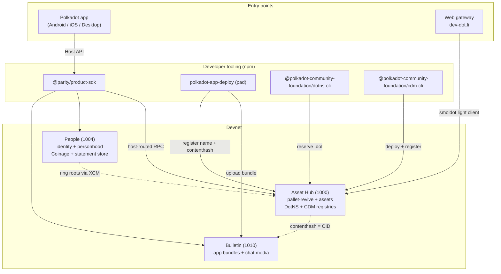
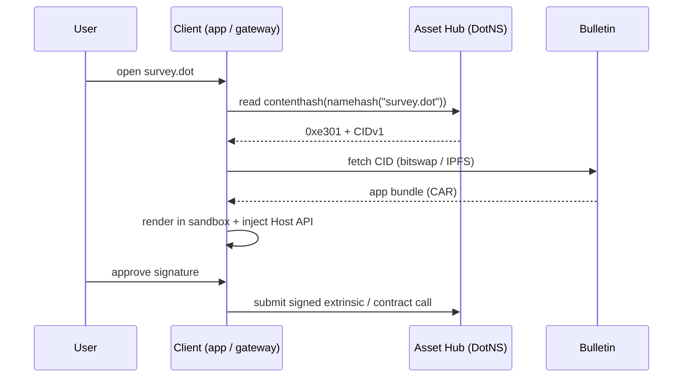

# Architecture overview

The Polkadot Products Devnet is a public developer preview for web-native apps
that are named, published, and opened through Polkadot infrastructure. A user
reaches them either through the Polkadot app or through the web gateway at
[dev-dot.li](https://dev-dot.li); in both cases the app runs client-side in a
sandboxed container.

This page is the map. It follows one request — a user opening a `.dot` app —
from a name to chain storage and back, then points to the subsystem pages where
the source-level detail lives.

!!! note "This is a devnet"
    Tokens have no real value and flows may change. Never enter a real seed
    phrase or private key that holds value on any mainnet.

## The pieces

The platform is a small set of cooperating layers:

- **The network** — a community-operated [Paseo](network.md) relay
  chain plus system parachains. App developers target **Asset Hub** (para 1000),
  which runs `pallet-revive` (PolkaVM/EVM contracts, chain id `420420417`),
  the `pallet-assets` suite, and the DotNS gateway pallet. Identity lives on the
  **People** chain (para 1004); web-app bundles live on the **Bulletin** chain
  (para 1010).
- **The client tier** — three native [Polkadot app](client.md)
  clients (Android, iOS, Desktop/Web) that hold keys on-device and host dApps in
  a sandboxed webview via a shared JavaScript **Host API**.
- **Naming** — [DotNS](naming.md), a set of PolkaVM contracts that
  turn a `.dot` domain into an owner, a resolver, and a content hash.
- **App delivery** — the [`pad` CLI](app-delivery.md) uploads a
  static bundle to Bulletin and binds its CID to a `.dot` domain; the
  [dotli gateway](app-delivery.md) resolves and renders it.
- **Smart contracts & CDM** — [contracts](contracts.md) are PolkaVM
  bytecode on Asset Hub, deployed and indexed by the Contract Dependency Manager.
- **Identity & personhood** — [proof-of-personhood](identity.md)
  tiers (Lite / Full) and a precompile any contract can read.
- **Money** — [CASH](money.md), a devnet "digital dollar" spent
  through the privacy-preserving Coinage system on the People chain.
- **Discovery** — [Browse](discovery.md), an on-chain publisher
  registry of listable apps.
- **Messaging** — [chat and calls](messaging.md) carried over the
  People-chain statement store, with media on Bulletin and WebRTC for calls.

## System diagram

## Request path: opening a `.dot` app

Consider a user opening `survey.dot`. The resolution is the same in spirit
whether they use the web gateway or the in-app browser; the trust model differs.

1. **Address to label.** On the web, the user visits
   `https://survey.dev-dot.li`; the dotli host derives the registrable root and
   the label `survey` from the subdomain. In the app, the user types `survey.dot`
   into the browser bar.
2. **Name to content hash.** The client computes the ENS-style namehash of
   `survey.dot` (`keccak256(DOT_NODE, keccak256("survey"))`) and reads
   `contenthash(node)` from the DotNS **ContentResolver** contract on Asset Hub.
   The web gateway does this trustlessly, reading contract storage directly
   through an in-browser **smoldot** light client — there is no RPC server in the
   path.
3. **Content hash to CID.** The `contenthash` bytes (`0xe301` + CIDv1) decode to
   an IPFS CID pointing at the app bundle.
4. **Fetch the bundle.** The content is fetched from the **Bulletin** chain
   (via smoldot `bitswap_v1_get`, shown verified) or an IPFS gateway. A directory
   arrives as a CAR archive, parsed into a file map served by a Service Worker
   virtual filesystem.
5. **Render sandboxed.** The bundle runs inside a sandboxed iframe (web) or
   platform webview (app). The client injects the **product-container** bundle
   (`@novasamatech/host-container` + `@novasamatech/host-api`), which establishes
   the Spektr `postMessage` channel and exposes `window.injectedWeb3.spektr`.
6. **App talks to the host.** Through the Host API the dApp requests accounts,
   permissions, signatures, and chain connections. All chain RPC is routed
   through the host container (the Product SDK is designed to run inside it), so
   the app never manages its own node connections or keys. On-device keys sign;
   the user approves each signature in a native modal.

From here the running app draws on the rest of the platform: it resolves package
names to contract addresses through the [CDM registry](contracts.md),
reads a caller's [personhood tier](identity.md) from the precompile
at `0x…0a010000`, moves [CASH](money.md), or lists itself in
[Browse](discovery.md). Messaging and calls run over the same
[People-chain statement store](messaging.md) the app already uses.

## Where to go next

- New here? Start with [Getting started](../getting-started/index.md).
- Building an app? Read [App delivery](app-delivery.md) and the
  [Product SDK](client.md), then
  [Build & publish a dApp](../guides/build-and-publish.md).
- Want addresses and endpoints? See [Reference](../reference/index.md).

## Learn more

- Product SDK on npm: <https://www.npmjs.com/package/@parity/product-sdk>
- Deploy CLI (`pad`): <https://www.npmjs.com/package/@parity/polkadot-app-deploy>
- Chain runtimes (paseo-network): <https://github.com/paseo-network/runtimes>
- dotli gateway: <https://github.com/paritytech/dotli-community>
- Polkadot developer docs: <https://docs.polkadot.com>
