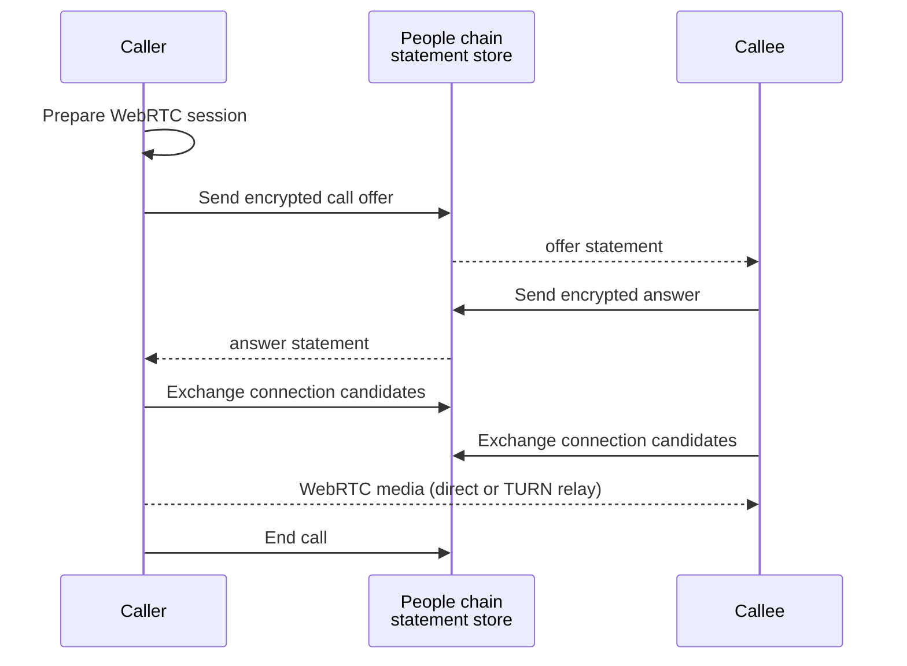
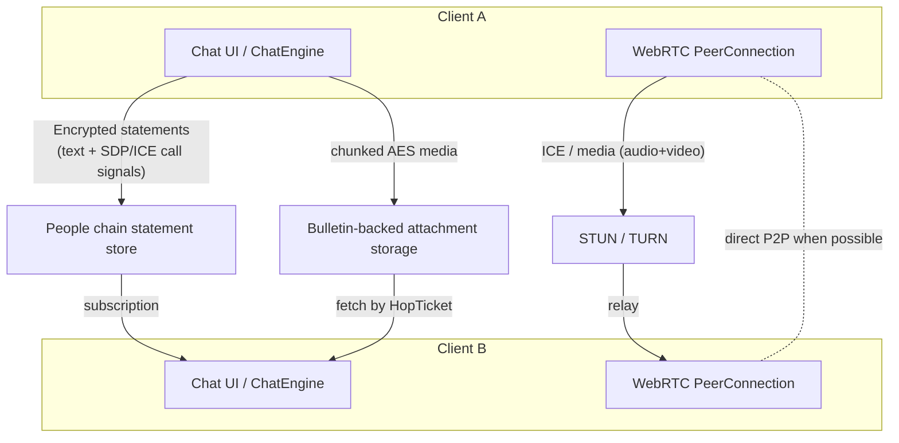

# Messaging & calls

The Polkadot app includes encrypted chat and one-to-one voice/video
calls. Both are built without a dedicated messaging or signaling server: text
messages and call-setup signals travel over the same on-chain channel, media
attachments are stored on a separate content chain, and the live audio/video
stream flows peer-to-peer over WebRTC. This page describes how those pieces fit
together and what users or Product developers should expect.

## Transport: the statement store

Text messages are neither stored on a server nor sent directly between devices.
Each message is encrypted on the sending device and published to the **statement
store on the People chain**. Recipients subscribe to that store and decrypt
messages locally.

The same channel carries text, reactions, replies, contact events, and call
setup signals. That shared transport is why chat and calls are part of the same
product surface.

### Encryption

Messages are encrypted per peer, not globally. Only encrypted statements are
submitted to the store; the People chain sees ciphertext.

## Media attachments: the Bulletin "hop"

Images, video, and files do **not** go through the statement store. Attachments
are encrypted and uploaded through Bulletin-backed storage, while the chat
message carries a reference that lets the recipient fetch and decrypt the file.
For more on Bulletin storage, see [The network](network.md).

## Voice & video calls

Calls use **WebRTC**. There is no dedicated signaling server: the offer, answer,
connection candidates, and call-close signals are sent as encrypted chat
messages over the statement store. Once peers connect, media flows directly when
possible, or through TURN when a relay is needed.

### NAT traversal (STUN & TURN)

When a direct WebRTC path is not available, clients can use temporary TURN
credentials. Those credentials are short-lived and are provided by platform
infrastructure, so Product apps should treat calling as a host-mediated service
rather than embedding TURN configuration themselves.

### Outgoing call flow (Android)

## Data paths at a glance

## Desktop specifics and device sync

Voice and video calls are a **mobile-only** feature today. The desktop build has
no call UI and cannot initiate or answer calls. Desktop uses WebRTC only for
device sync and peer-to-peer chat; it shares the same broad building blocks for
chat and sync, but calling stays on the mobile app.

## Common blockers

- **A message appears delayed.** The sender and recipient both depend on the
  statement store subscription and local decryption.
- **An attachment does not open.** The encrypted attachment reference may be
  present before the content is available from Bulletin-backed storage.
- **A call connects only through a relay.** That is expected on some networks;
  TURN credentials are platform-provided and can change.
- **You want to place a call from desktop.** Calling is mobile-only today; the
  desktop build has no call UI. Use the mobile app to start or answer calls.

## Learn more

- [Polkadot Android](https://github.com/Polkadot-Community-Foundation/polkadot-android-community) — source for the chat engine and call stack
- [Messaging & calls](../guides/messaging-and-calls.md) — the user-facing flow
