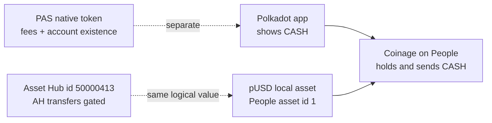
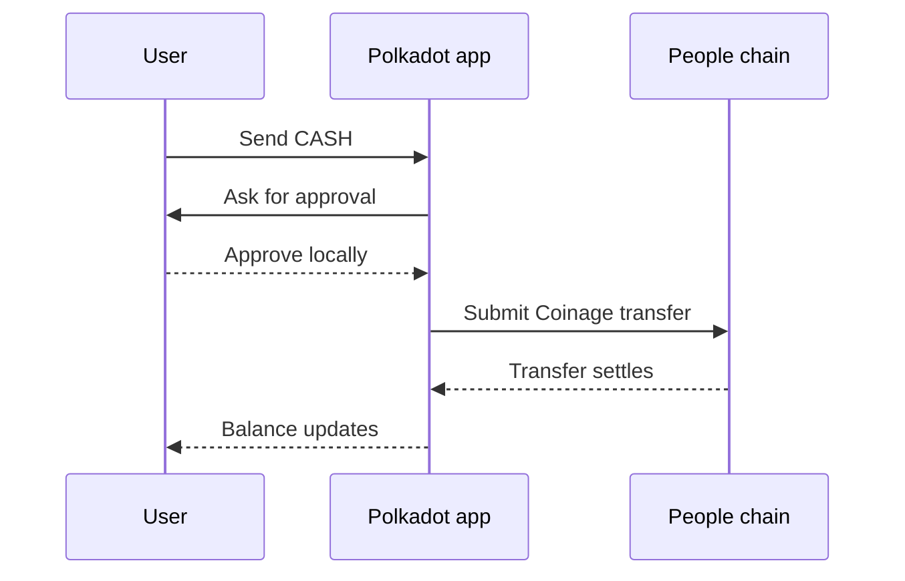

# Money: CASH & funding

This page explains the money model used by the Polkadot Products Devnet: what
**CASH** means in the app, why it is different from the native token used for
fees, and how funds move through the user-facing flows.

## The two balances to understand

Users see **CASH** in the Polkadot app. CASH is the app-facing name for a devnet
digital-dollar asset. It is the balance users top up, earn, and send to other
people inside the app.

The chains also have a native token, **PAS**, used for fees and account
existential deposits on Paseo-based chains. CASH and PAS are separate:

- **CASH** is the spendable app balance.
- **PAS** is the native network token used for fees.
- Both are devnet-only and have no real value.

This distinction matters when troubleshooting. A user can have CASH for app
payments but still need a small amount of PAS for network fees or account
existence.

## Where CASH fits

CASH is built on the Polkadot asset stack and is used through the **People**
chain by the Polkadot app. On People, the balance is a local pUSD asset
(**asset id `1`**) that Coinage denominates and presents as CASH. The same
logical value is also represented on **Asset Hub**, where the id is
`50000413` — a protected asset whose Asset-Hub-side transfers are gated.

For day-to-day use, people do not need to move assets between chains manually.
The app presents CASH as a single balance and handles the chain-specific work
behind the scenes.

## How CASH is held

CASH is not treated like a simple account balance in the app. It is held and
spent through **Coinage**, a People-chain system that represents value as coins.
When a user sends CASH, the app prepares and submits a Coinage transfer rather
than a plain token transfer.

That model is important for developers because app-facing payment flows should
use the platform services exposed by the host and SDK. A Product app should not
try to reimplement the wallet, key handling, or low-level payment flow.

## How users get CASH

There are three common paths:

1. **Get CASH in the app.** Devnet builds can expose a top-up action that funds
   the account and onboards value into the CASH balance.
2. **Use the faucet.** The public Polkadot faucet can provide devnet funds,
   especially native PAS for fees.
3. **Earn rewards.** Some app and personhood flows can reward users with value
   that is later shown as CASH.

The important user expectation is simple: once onboarding completes, the balance
in your **Pocket** updates and the user can spend it.

## Sending CASH

Sending CASH is a wallet-mediated action:

1. The user chooses a recipient and amount in the Polkadot app.
2. The app prepares the Coinage transfer.
3. The user approves the action locally.
4. The app submits the transaction and waits for settlement.

## What developers should rely on

Developers building Products should treat CASH as a platform service surfaced by
the host and SDK. The useful integration boundary is:

- ask the host for the user's account and permissions;
- use SDK / host-provided payment and chain APIs;
- let the Polkadot app handle signing and key custody;
- display amounts clearly as devnet value.

Avoid hardcoding operator accounts, funding assumptions, or private chain
configuration into an app. Network presets, live endpoints, and registry
addresses are supplied by the Devnet operators.

## Learn more

- [`pallet-coinage`](https://github.com/paritytech/individuality-community/blob/main/pallets/coinage/src/lib.rs) — the source: how CASH is represented as coins, held, and transferred
- [paseo-network/runtimes](https://github.com/paseo-network/runtimes) — the chain runtimes and asset definitions
- [Get & use CASH](../guides/get-and-use-cash.md) — do it
