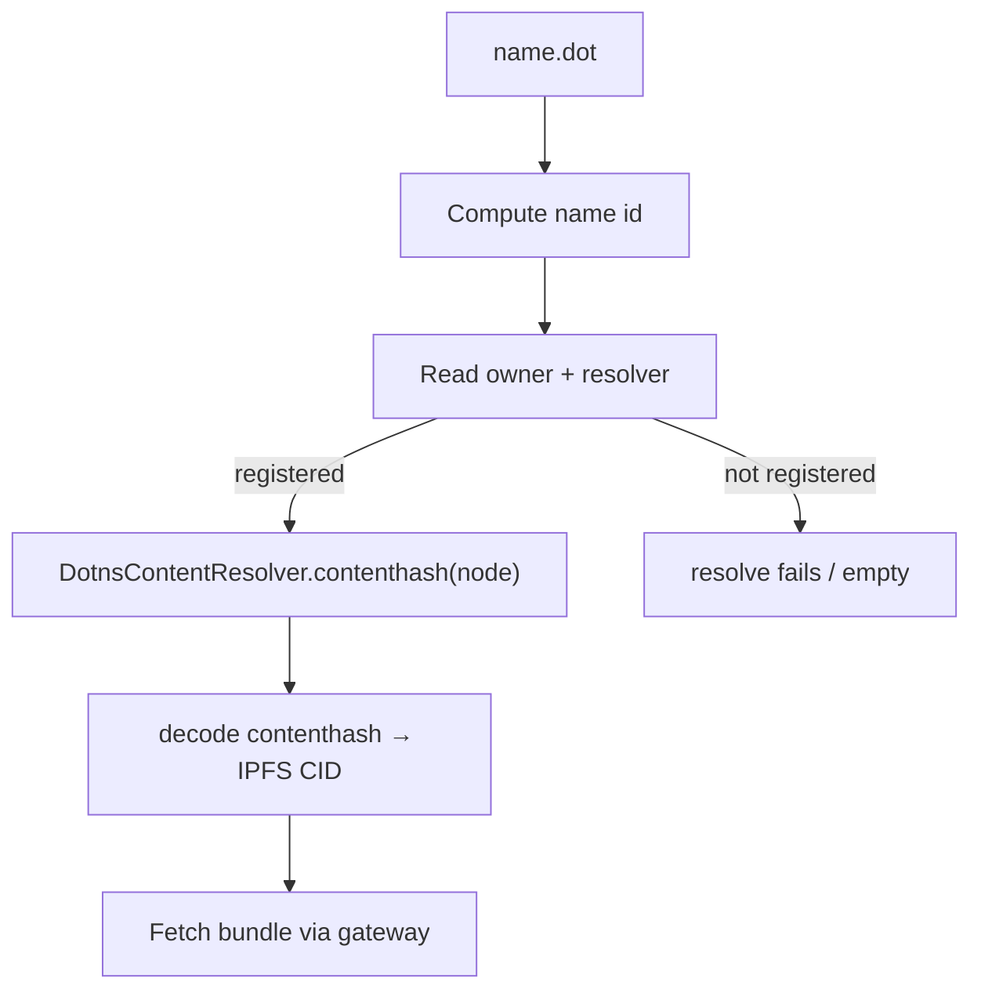
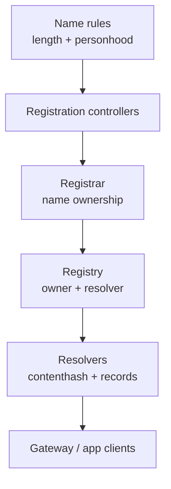

# Naming: DotNS

DotNS is the `.dot` naming system for the Polkadot Products Devnet. It answers a
single question that every gateway, client, and directory app needs to answer:
given a human-readable name like `survey.dot`, what does it point to, and who is
allowed to change it? This page explains the mental model: ownership, records,
resolution, and the personhood rules around names.

DotNS is implemented as PolkaVM contracts and consumed by the DotNS CLI, the web
gateway, and Product tooling. The useful idea for readers is that names are
on-chain records: if the record changes, every client that resolves the name sees
the new target.

!!! note
    This is a public developer preview. Devnet tokens have no real value, and
    contract addresses may change as the network is redeployed. Where this page
    shows a concrete address, treat it as an example — the authoritative address
    book for each network is carried in the tooling and provided by the team
    operating the network.

## The name model

Each `.dot` name has two important pieces of state:

- **Owner** — the account or contract that controls the name.
- **Resolver records** — the data attached to the name, including the content
  hash that points to an app bundle.

Internally, DotNS hashes names into fixed-width identifiers so contracts can look
them up efficiently. Users and app developers normally do not need to calculate
those hashes themselves; the CLI, SDK, gateway, and host tooling do it.

## Resolving `name.dot` to an app bundle

Resolution is a read-only path. A client never needs a naming server: it computes
the node locally and reads two contracts.

The resolution path is:

1. Form `domain = <label>.dot` and compute `node = namehash(domain)`.
2. Read `DotnsRegistry.recordExists(node)` and `DotnsRegistry.owner(node)`. If the
   record does not exist or the owner is the zero address, resolution stops with
   an empty result.
3. Read `DotnsContentResolver.contenthash(node)`, which returns the ENS-style
   contenthash bytes for the name.
4. Decode those bytes to an IPFS CID.
5. Fetch the application bundle from the gateway.

The web gateway at [dev-dot.li](https://dev-dot.li) follows the same path and
renders the resolved bundle in a sandboxed frame. How that content is uploaded
and how the contenthash gets written is covered in
[App delivery](./app-delivery.md).

!!! tip
    Because resolution is a plain contract read, you can verify any name yourself
    with the DotNS CLI: `dotns content view <name> --env <network>`. The concrete
    `--env` value is provided by the team operating the network.

## Contract topology

DotNS separates ownership, records, and control into distinct contracts. That
separation lets the system rotate pieces of the protocol without changing the
basic model that clients depend on.

- **Registrar** records who owns a `.dot` name.
- **Registry** connects the name to its resolver.
- **Resolvers** hold the records that clients read, including the content hash
  for an app bundle.
- **Name rules** decide which names are open, which are reserved, and which need
  personhood.

## Registration

The public registration path is a two-phase commit-reveal, which prevents
front-running of a chosen name. In practice, the CLI guides developers through
the flow:

1. Validate and normalise the label (single lowercase DNS label, minimum length
   3 — shorter labels revert with `LabelTooShort`).
2. Classify and price the label via `PopRules`, and check whether it is reserved.
3. Commit to the name without revealing the full registration.
4. Wait for the commitment window.
5. Reveal the registration, mint the name, and write its initial records.

Names can also be transferred (the ERC-721 token moves) and subnames created by
the base-name owner via `setSubnodeOwner`.

## Reserved and short-name gating

Not every label is available on the public path. `PopRules` classifies each label
by the length of its **stem** (the label with any trailing digits stripped) and
gates accordingly:

| Tier | Condition | Effect |
| --- | --- | --- |
| Reserved | stem ≤ 5 characters | short names are gated |
| PopLite | stem 6–8, exactly 2 trailing digits | lite personhood username |
| PopFull | stem 6–8, no trailing digits | full personhood username |
| NoStatus | stem ≥ 9 characters | open, deposit-backed |

Labels with 1 or more than 2 trailing digits are rejected. Governance-reserved and
name-reserved labels revert on the public controller; a separate owner-managed
whitelist (`registerReserved`) can bypass PoP pricing for specific addresses.

Personhood-gated names come through a controlled path tied to the personhood
system rather than the public commit-reveal path. Product developers normally
interact with this through the app, CLI, or DotNS services, not by calling those
contracts directly.

## Learn more

- DotNS contracts: <https://github.com/paritytech/dotns>
- DotNS SDK — CLI and reference UI: <https://github.com/paritytech/dotns-sdk>
- `@parity/dotns-cli` on npm: <https://www.npmjs.com/package/@parity/dotns-cli>
- DotNS reference UI (devnet): <https://dotns.dev-dot.li>
- Web gateway: <https://dev-dot.li>
- Polkadot developer docs: <https://docs.polkadot.com>
