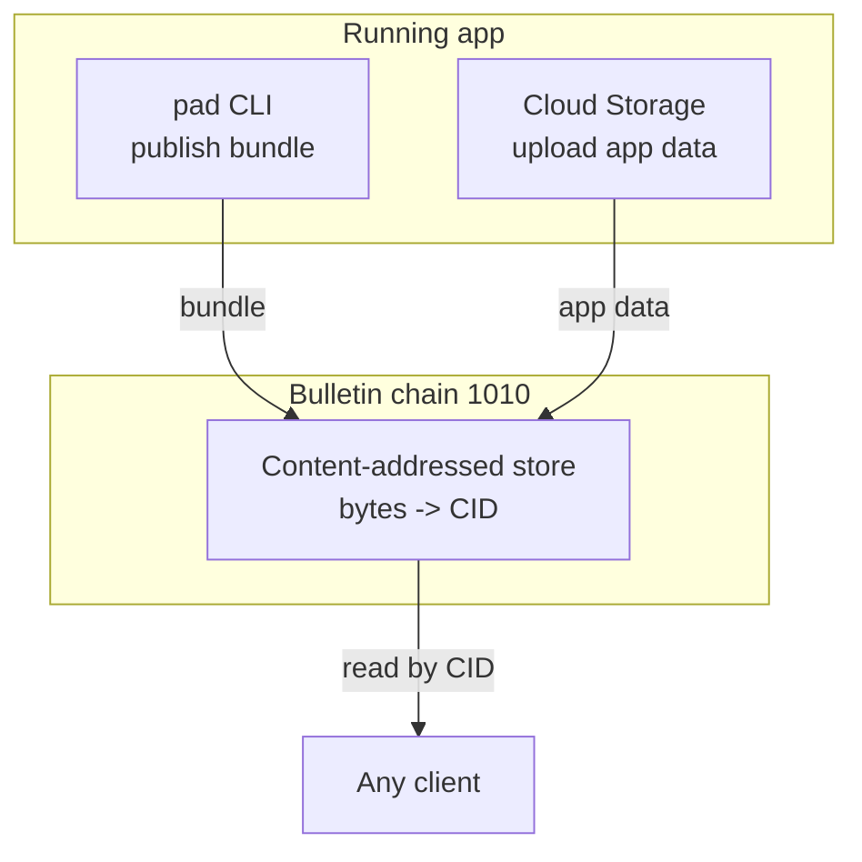
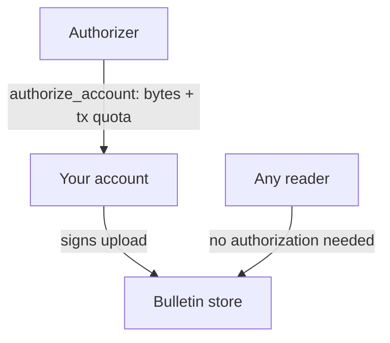

# Storage & data

Apps on the Polkadot Products Devnet keep their data in one place: the
**Bulletin chain** (para 1010), a content-addressed on-chain store. This is the
platform's dedicated way for an app to persist data — you hand it bytes and get
back a content identifier (CID); anyone can read those bytes back by CID.
Because content is addressed by its own hash, the same bytes always resolve to
the same CID, and the client can verify what it fetched.

The same substrate carries two different kinds of content:

- **App bundles** — the static frontend a developer publishes. The `pad` CLI
  uploads the build and binds its CID to a `.dot` name. This is the write side of
  [app delivery](app-delivery.md).
- **App data** — anything a running app stores at runtime (documents, media,
  records). Apps reach it through the host's **Cloud Storage** service rather
  than talking to the chain directly.



## Cloud Storage: the proper way to store app data

When an app needs to persist data, it uses **Cloud Storage** — content-addressed
storage backed by Bulletin, exposed through the Host API and the
[Product SDK](../guides/platform-services-sdk.md#store-and-retrieve-data-cloud-storage).
The shape is deliberately small: upload bytes, get a CID, fetch by CID.

```ts
const cloud = app.cloudStorage;          // null if the service is disabled
const uploaded = await cloud.upload(bytes);   // -> Result<CID>
if (uploaded.ok) {
  const back = await cloud.fetch(uploaded.value); // -> Result<Uint8Array>
}
```

A few properties worth knowing before you design around it:

- **Content-addressed, not a key–value store.** You get back a CID for exactly
  the bytes you stored; there is no mutable "path" you overwrite. To model
  updatable state, store the new version and keep the CID that points to it
  (for example in a `.dot` record, a contract, or another Cloud Storage object).
- **Reads are open; writes are authorized.** Anyone can fetch a CID. Uploading
  needs a connected account with a storage authorization — see below.
- **Reads are container-only.** The client fetches through the host/light-client
  path; there is no public IPFS-gateway fallback.
- **Pick the right network.** `cloudStorage.environment` must be `devnet` for
  this network — it defaults to `paseo`, a different chain, and nothing errors if
  you get it wrong (your data is simply written where you did not expect it).

The API details and the `Result` idiom live in the
[Product SDK guide](../guides/platform-services-sdk.md#store-and-retrieve-data-cloud-storage).

## How storage authorization works

Bulletin storage is **authorization-based, not fee-based**. You do not pay a
per-upload token fee; instead the uploading account must hold a live
**authorization** — an on-chain quota of bytes and transactions granted by an
**authorizer**. Reading never needs one; authorization gates *storing*, not
retrieval.



The account that **signs** an upload is the account that spends the quota — so
that is the account to authorize. For publishing, that is the account that owns
your `.dot` name; for Cloud Storage, it is the connected user account.

**Why it is gated — and why this Devnet keeps it open.** Writing to an
un-metered public store invites spam, so in production the write-gate is
typically tied to proof of personhood or an operator-run authorizer. This Devnet
deliberately leaves it open: a public **Storage Faucet** and a shared authorizer
let any developer self-serve an allowance without a personhood check. Grant one
from the Faucet tab of the
[Bulletin Chain Console](https://paritytech.github.io/polkadot-bulletin-chain/)
(select the **Products Devnet** network); the practical publishing steps are in
[Get storage authorization](../guides/build-and-publish.md#get-storage-authorization).

!!! note "Authorizations are finite and expire"
    An authorization is a bounded quota with an expiry, not a permanent grant.
    The Console lists current authorizations and when each lapses. If a deploy or
    upload that used to work suddenly stops at the storage step, the allowance has
    most likely run out or expired — grant it again and retry. Content that was
    already stored is unaffected; the limit is on new writes.

## Learn more

- [App delivery](app-delivery.md) — publishing an app bundle to Bulletin and
  binding it to a `.dot` name
- [Store and retrieve data (Cloud Storage)](../guides/platform-services-sdk.md#store-and-retrieve-data-cloud-storage) — the SDK API, in code
- [Get storage authorization](../guides/build-and-publish.md#get-storage-authorization) — grant an allowance and publish
- [polkadot-bulletin-chain](https://github.com/paritytech/polkadot-bulletin-chain) — the storage pallet and quota model
