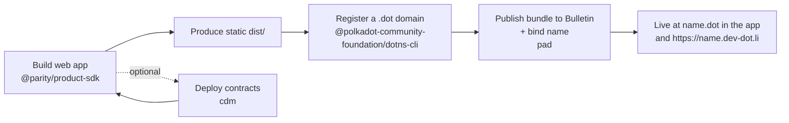

# Getting Started for Developers

This path is for building a first Product on the **Polkadot Products Devnet**.
The basic loop is small: build a static web app, give it a `.dot` domain, publish
the bundle, and use the SDK when the app needs platform services.

## The shape of a first app



A Product is a **static web app**: HTML, CSS, and JavaScript. It runs inside a
host — the Polkadot app or the web gateway at
[https://dev-dot.li](https://dev-dot.li) — which provides the wallet, signing
prompts, storage, and chain access. Publishing means making the bundle available
on the Devnet and pointing a `.dot` domain at it.

## Before you start

Before running the commands below, make sure you have:

- **The tooling installed** — the Product SDK and the CLIs (`dotns`, `pad`, `cdm`); Step 1 covers this.
- **A funded, mapped signing account** — an account with native devnet tokens for fees (from the faucet) whose EVM address is mapped on Asset Hub. `dotns`, `pad`, and `cdm` all sign PolkaVM transactions on Asset Hub with it.
- **Storage authorization to publish** — the publish step (Step 5) also needs a Bulletin storage allowance, granted either from the [Storage Faucet](https://paritytech.github.io/polkadot-bulletin-chain/authorizations?tab=faucet) or with the `pad-bootstrap` CLI. See [Get storage authorization](../guides/build-and-publish.md#get-storage-authorization).

## 1. Install the tooling

The developer packages are published to npm.

```bash
# Product SDK (typed access to chains, wallet, storage, identity)
npm i @parity/product-sdk

# Host API (transport used when your app runs inside the Polkadot app)
npm i @novasamatech/host-api

# CLIs (install globally)
npm i -g @polkadot-community-foundation/dotns-cli          # dotns — register/manage .dot domains
npm i -g @parity/polkadot-app-deploy # pad, pad-bootstrap — publish bundles + authorize storage
npm i -g @polkadot-community-foundation/cdm-cli            # cdm    — build/deploy/register contracts
```

## 2. Choose a network preset

Every CLI takes the network as a flag, and this Devnet is **`devnet`**:

- `pad` and `dotns` take `--env devnet`.
- `cdm` takes `-n devnet` (also spelled `--name`).

!!! warning "Do not use the `paseo` preset"
    The CLIs also ship `paseo` and `paseo-next` presets. Those point at
    different networks — picking one silently targets the wrong chain, and your
    app will not appear on this Devnet.

## 3. Build a web app with the Product SDK

The Product SDK (`@parity/product-sdk`) gives your app typed access to the host:
wallet information, storage, chain calls, contracts, identity, and React
helpers.

```ts
import { createApp } from "@parity/product-sdk";

const app = await createApp({ name: "my-app" });

// Read/write chain, cloud storage, wallet, etc.
const cid = await app.cloudStorage.upload("hello world");
```

!!! warning "Run inside a host"
    SDK calls expect the Polkadot app or the web gateway to provide the host
    connection. For a starting point, use the
    [dotli-starter](https://github.com/paritytech/dotli-starter) template. For
    automated tests, use `@parity/host-api-test-sdk`.

Build your app to a static directory (the reference template uses `vite build` → `dist/`).

## 4. Register a `.dot` domain

Your deploy account must **own** the `.dot` domain before you can publish to it.
Register it with the DotNS CLI.

```bash
dotns register domain --name my-app --env devnet
```

Public names go through a commit-reveal flow and must be at least three
characters. Short or reserved names are gated by proof of personhood. See
[Naming (DotNS)](../architecture/naming.md) for the classification rules.

## 5. Publish the bundle with `pad`

`pad` publishes your static build and updates the `.dot` domain so clients know
which bundle to open.

```bash
pad ./dist my-app.dot --env devnet
```

!!! note "Two prerequisites"
    Your signing account must **own** `my-app.dot` and have permission to upload
    app content on the Devnet. If publishing fails because storage authorization
    is missing or expired, refresh that authorization and run the command again.

To list your app in the Browse directory, add `--publish`. Your app is then
reachable as `my-app.dot` in the Polkadot app and at
`https://my-app.dev-dot.li` on the gateway.

## 6. Optional — deploy contracts with `cdm`

Smart contracts on this Devnet are PolkaVM contracts on Asset Hub. The Contract
Dependency Manager helps you build, deploy, publish metadata, and register
addresses so downstream apps can find the contracts they depend on.

```bash
cdm init -n devnet       # scaffold a project
cdm deploy -n devnet     # build, deploy, publish metadata, register
```

Downstream projects can consume a published contract package with `cdm install`.
Browse published contracts at
[https://contracts.dev-dot.li](https://contracts.dev-dot.li).

## Try the reference apps

Working examples are the fastest way to see the shape of a Product — start with
[Playground](https://playground.dev-dot.li) or
[Simple Survey](https://survey.dev-dot.li); the full list is in
[More resources](../reference/resources.md).

To test as an end user, install the app and fund an account — see
[Getting started for users](users.md).

## Learn more

- [Build & Publish Applications](../guides/build-and-publish.md) — the full publishing path
- [Use platform services from the SDK](../guides/platform-services-sdk.md) — chains, storage, contracts, identity
- [dotli-starter](https://github.com/paritytech/dotli-starter) — a template to start from
