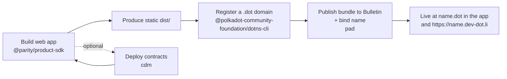

# Getting Started for Developers

This path is for building a first Product on the **Polkadot Products Devnet**.
The basic loop is small: build a static web app, give it a `.dot` domain, publish
the bundle, and use the SDK when the app needs platform services.

!!! note "This is a devnet"
    Tokens on this network have no real value, and flows may change. Never
    commit or print mnemonics, seed phrases, or private keys.

## The shape of a first app



A Product is a **static web app**: HTML, CSS, and JavaScript. It runs inside a
host — the Polkadot app or the web gateway at
[https://dev-dot.li](https://dev-dot.li) — which provides the wallet, signing
prompts, storage, and chain access. Publishing means making the bundle available
on the Devnet and pointing a `.dot` domain at it.

## 1. Install the tooling

The developer packages are published to npm.

```bash
# Product SDK (typed access to chains, wallet, storage, identity)
npm i @parity/product-sdk

# Host API (transport used when your app runs inside the Polkadot app)
npm i @novasamatech/host-api

# CLIs (install globally)
npm i -g @polkadot-community-foundation/dotns-cli          # dotns — register/manage .dot domains
npm i -g @parity/polkadot-app-deploy # pad   — publish app bundles
npm i -g @polkadot-community-foundation/cdm-cli            # cdm    — build/deploy/register contracts
```

## 2. Choose a network preset

Each CLI selects a network with a preset flag. Use the preset provided for the
public Polkadot Products Devnet and keep it consistent across tools.

- `pad` and `dotns` take `--env <network>`.
- `cdm` takes `-n/--name <preset>` instead (for example `-n paseo`).

!!! tip
    Ask the network operator which preset maps to the public `dev-dot.li`
    Products Devnet, then use it consistently across every command below.

## 3. Build a web app with the Product SDK

The Product SDK (`@parity/product-sdk`) gives your app typed access to the host:
wallet information, storage, chain calls, contracts, identity, and React
helpers.

```ts
import { createApp } from "@parity/product-sdk";

const app = await createApp({ name: "my-app" });

// Read/write chain, cloud storage, wallet, etc.
const cid = await app.cloudStorage.upload("hello world");
```

!!! warning "Run inside a host"
    SDK calls expect the Polkadot app or the web gateway to provide the host
    connection. For a starting point, use the
    [dotli-starter](https://github.com/paritytech/dotli-starter) template. For
    automated tests, use `@parity/host-api-test-sdk`.

Build your app to a static directory (the reference template uses `vite build` → `dist/`).

## 4. Register a `.dot` domain

Your deploy account must **own** the `.dot` domain before you can publish to it.
Register it with the DotNS CLI.

```bash
dotns register domain --name my-app --env <network>
```

Public names go through a commit-reveal flow and must be at least three
characters. Short or reserved names are gated by proof of personhood. See
[Naming (DotNS)](../architecture/naming.md) for the classification rules.

## 5. Publish the bundle with `pad`

`pad` publishes your static build and updates the `.dot` domain so clients know
which bundle to open.

```bash
pad ./dist my-app.dot --env <network>
```

!!! note "Two prerequisites"
    Your signing account must **own** `my-app.dot` and have permission to upload
    app content on the Devnet. If publishing fails because storage authorization
    is missing or expired, refresh that authorization and run the command again.

To list your app in the Browse directory, add `--publish`. Your app is then
reachable as `my-app.dot` in the Polkadot app and at
`https://my-app.dev-dot.li` on the gateway.

## 6. Optional — deploy contracts with `cdm`

Smart contracts on this Devnet are PolkaVM contracts on Asset Hub. The Contract
Dependency Manager helps you build, deploy, publish metadata, and register
addresses so downstream apps can find the contracts they depend on.

```bash
cdm init -n <preset>       # scaffold a project
cdm deploy -n <preset>     # build, deploy, publish metadata, register
```

Downstream projects can consume a published contract package with `cdm install`.
Browse published contracts at
[https://contracts.dev-dot.li](https://contracts.dev-dot.li).

## Try the reference apps

- Browse (app directory) — [https://browse.dev-dot.li](https://browse.dev-dot.li)
- DotNS UI — [https://dotns.dev-dot.li](https://dotns.dev-dot.li)
- Playground — [https://playground.dev-dot.li](https://playground.dev-dot.li)
- Simple Survey — [https://survey.dev-dot.li](https://survey.dev-dot.li)
- Mercado (marketplace) — [https://mercado.dev-dot.li](https://mercado.dev-dot.li)
- localdot (local marketplace) — [https://localmarket.dev-dot.li](https://localmarket.dev-dot.li)

To test as an end user, install the app: [Android APK](https://get.polkadotcommunity.foundation/android/latest.apk), [iOS TestFlight](https://testflight.apple.com/join/VvC8SHVE), or [Desktop](https://polkadotcommunity.foundation/desktop/). Fund a devnet account at the [faucet](https://faucet.polkadot.io) for native tokens, or use the in-app CASH top-up. See [Getting started for users](users.md).

## Learn more

- Guide: [Build & publish a dApp](../guides/build-and-publish.md)
- Guide: [Register a .dot domain](../guides/register-a-dot-name.md)
- Guide: [Deploy & register contracts](../guides/deploy-contracts-cdm.md)
- Guide: [Use platform services from the SDK](../guides/platform-services-sdk.md)
- Architecture: [App delivery](../architecture/app-delivery.md) · [Naming (DotNS)](../architecture/naming.md) · [Smart contracts & CDM](../architecture/contracts.md)
- Reference: [Networks & endpoints](../reference/networks.md) · [Packages & tools](../reference/packages.md)
- [Product SDK on npm](https://www.npmjs.com/package/@parity/product-sdk) · [Product SDK source](https://github.com/paritytech/product-sdk) · [polkadot-app-deploy source](https://github.com/paritytech/polkadot-app-deploy) · [dotli-starter template](https://github.com/paritytech/dotli-starter)
- [Official Polkadot developer docs](https://docs.polkadot.com)
