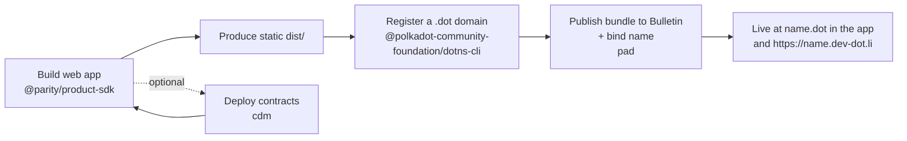

# Getting Started for Developers

This path is for building a first Product on the **Polkadot Products Devnet**.
The basic loop is small: build a static web app, give it a `.dot` domain, publish
the bundle, and use the SDK when the app needs platform services.

## The shape of a first app



A Product is a **static web app**: HTML, CSS, and JavaScript. It runs inside a
host — the Polkadot app or the web gateway at
[https://dev-dot.li](https://dev-dot.li) — which provides the wallet, signing
prompts, storage, and chain access. Publishing means making the bundle available
on the Devnet and pointing a `.dot` domain at it.

## Before you start

Every command below runs through the CLIs you install in
[step 1](#1-install-the-tooling), so install those first. You also need **one
signing account** — if you don't already have a key,
[mint a throwaway one](#4-set-up-an-account-and-register-a-dot-domain) (no seed
to import, no password). That account has to be ready in three ways before any
command touches the chain:

1. **Funded** with native tokens on Asset Hub for fees —
   [Faucet](../reference/networks.md#faucet).
2. **Mapped** to its EVM address, once: `dotns account map --env devnet`.
   Every CLI here signs PolkaVM transactions on Asset Hub, and an unmapped
   account fails on the first one.
3. **Authorized** to write to Bulletin, so step 5 can upload your bundle —
   [Get storage authorization](../guides/build-and-publish.md#get-storage-authorization).

The CLIs do not share a keystore: `dotns` keeps its own (step 4), and `pad`
takes `--mnemonic` on the command line. They can use the same account.

## 1. Install the tooling

--8<-- "install-clis.md"

Your app code needs the SDK too — see
[Packages & tools](../reference/packages.md) for the full list:

```bash
npm i @parity/product-sdk
```

## 2. Choose a network preset

Every CLI takes the network as a flag, and this Devnet is **`devnet`**:
`--env devnet` for `pad` and `dotns`, `-n devnet` for `cdm`.

!!! warning "Always pass the flag"
    The same binaries ship `paseo` and `paseo-next` presets pointing at other
    networks, and the default is not `devnet`. Omit the flag and your app lands
    on a different chain, where nothing on this Devnet can see it.

## 3. Build a web app with the Product SDK

The Product SDK (`@parity/product-sdk`) gives your app typed access to the host:
wallet, storage, chain calls, contracts, and identity.

```ts
import { createApp } from "@parity/product-sdk";

const app = await createApp({
  name: "my-app",
  cloudStorage: { environment: "devnet" }, // defaults to paseo
});

const result = await app.cloudStorage!.upload("hello world");
if (result.ok) console.log(result.value); // the CID
```

!!! warning "Run inside a host"
    The SDK expects the Polkadot app or the web gateway to provide the host
    connection. Outside one, `createApp()` itself throws
    `Host storage unavailable`. Start from the
    [dotli-starter](https://github.com/paritytech/dotli-starter) template, and
    use `@parity/host-api-test-sdk` for automated tests. See
    [Use platform services from the SDK](../guides/platform-services-sdk.md).

Build your app to a static directory (the reference template uses `vite build` → `dist/`).

## 4. Set up an account and register a `.dot` domain

Your deploy account must **own** the `.dot` domain before you can publish to it.
This is a CLI signing key, separate from any account in the Polkadot app.

--8<-- "throwaway-account.md"

??? note "Prefer to reuse an account across sessions?"
    Store a mnemonic or key-uri in the encrypted `dotns` keystore instead of
    the environment:

    ```bash
    dotns auth set          # choose `mnemonic`, paste it, then set a password
    dotns account address   # confirm the active account
    ```

    The keystore password is then needed by every later command — export
    `DOTNS_KEYSTORE_PASSWORD` to avoid an interactive prompt. See
    [Register a `.dot` domain](../guides/register-a-dot-name.md#set-up-an-account).

With `$MNEMONIC` exported, register your name:

```bash
dotns register domain --name my-cool-app --env devnet
```

Use a label whose **stem is nine characters or longer**; shorter ones are gated
behind proof of personhood. Registration is a commit-reveal flow that takes a
few minutes, so confirm it landed before moving on:

```bash
dotns lookup owner-of my-cool-app --env devnet
```

See [Register a `.dot` domain](../guides/register-a-dot-name.md) for the full
rules.

## 5. Publish the bundle with `pad`

`pad` uploads your static build and points the `.dot` domain at it. It does not
read the dotns keystore — give it the signer that owns the name:

```bash
pad ./dist my-cool-app.dot --env devnet --mnemonic "$MNEMONIC"
```

That account must own the name and hold a Bulletin storage authorization; a
successful run ends with `Verified on-chain:` and the published CID.

Your app is now reachable as `my-cool-app.dot` in the Polkadot app and at
`https://my-cool-app.dev-dot.li` on the gateway. To give it a name, description
and icon in the directory, add a product config — see
[Add card metadata](../guides/build-and-publish.md#add-card-metadata).

To also list it in Browse, add `--publish`. That step needs proof of personhood,
which today comes from the Polkadot app rather than the CLI; without it the
deploy still succeeds and the app simply is not listed. See
[List your app in Browse](../guides/list-in-browse.md).

## 6. Optional — deploy contracts with `cdm`

Smart contracts on this Devnet are PolkaVM contracts on Asset Hub. The Contract
Dependency Manager builds, deploys, publishes metadata, and registers addresses
so downstream apps can resolve contracts by name.

`cdm` needs a Rust toolchain that `npm i -g` does not install — run `cdm setup`
first. See [Deploy & register contracts](../guides/deploy-contracts-cdm.md) for
the full sequence.

## Continue in the guides

This page is the quickstart; each step has a full guide with the rules and edge
cases. Find them all under the **Guides** tab:

<div class="grid cards" markdown>

-   **[Build & Publish Applications](../guides/build-and-publish.md)**

    ---

    The full publishing path — bundle, name, deploy, and card metadata.

-   **[Register a `.dot` domain](../guides/register-a-dot-name.md)**

    ---

    Account setup, name rules, and the commit-reveal flow in depth.

-   **[Deploy & register contracts](../guides/deploy-contracts-cdm.md)**

    ---

    Build, deploy, and register PolkaVM contracts with `cdm`.

-   **[Use platform services from the SDK](../guides/platform-services-sdk.md)**

    ---

    Chains, storage, contracts, and identity from your app.

-   **[List your app in Browse](../guides/list-in-browse.md)**

    ---

    Get your Product into the in-app directory.

</div>

## Try the reference apps

Working examples are the fastest way to see the shape of a Product — start with
[Playground](https://playground.dev-dot.li) or
[Simple Survey](https://survey.dev-dot.li); the full list is in
[More resources](../reference/resources.md). The
[dotli-starter](https://github.com/paritytech/dotli-starter) template is a good
skeleton to build from.

To test as an end user, install the app and fund an account — see
[Create an account & get funds](../guides/create-account.md).
