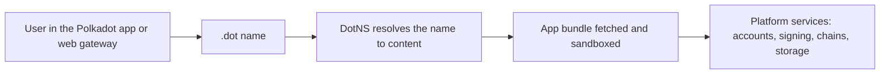

# Getting Started

Start here if you are new to the **Polkadot Products Devnet**. This section
helps you choose the right path: trying the Polkadot app as a user, or building
a Product that runs inside it.

!!! warning "This is a devnet"
    The Polkadot Products Devnet is a preview environment. Devnet tokens have
    **no real value**, on-chain state may be reset, and platform behaviour and
    interfaces may change without notice. Do not use it to hold anything of value.

## Choose your path

-   ### For users

    Install the Polkadot app or open the web gateway at
    [dev-dot.li](https://dev-dot.li). From there you can create a devnet
    account, get funds, and open apps already published on the network.

    [Start using the platform →](users.md)

-   ### For developers

    Build a web app, register a `.dot` name, publish it to the Devnet, and use
    platform services such as accounts, signing, chains, contracts, and storage
    through the Product SDK.

    [Start building →](developers.md)

## What this Devnet lets you try

The Devnet connects the user app, naming, app delivery, and developer tooling
into one public preview:

- **Use the Polkadot app** with an on-device account, a People Chain username,
  chat, and devnet payments.
- **Open Products by name** through `.dot` addresses, either in the app or
  through the web gateway at
  [dev-dot.li](https://dev-dot.li).
- **Publish your own Product** as a static web app and bind it to a `.dot` name
  so others can open it the same way.

!!! note "Getting test funds"
    Devnet accounts are funded from the
    [Polkadot faucet](https://faucet.polkadot.io); some app builds can also fund
    new accounts automatically. The tokens carry no value, but you still need
    them for fees and app flows.

## How it fits together

The main idea is simple: a user opens a `.dot` name, the platform resolves that
name to an app bundle, and the app runs in a host that provides the wallet and
chain services.

For the deeper model, read the [architecture overview](../architecture/index.md).

## Learn more

- [For users](users.md) — install the app and create an account
- [For developers](developers.md) — set up the SDK and tools
- [Architecture overview](../architecture/index.md) — how the platform works
- [Web gateway](https://dev-dot.li) — open devnet apps in a browser
- [Polkadot developer docs](https://docs.polkadot.com) — the broader Polkadot stack
