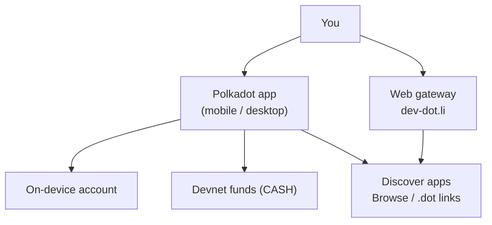
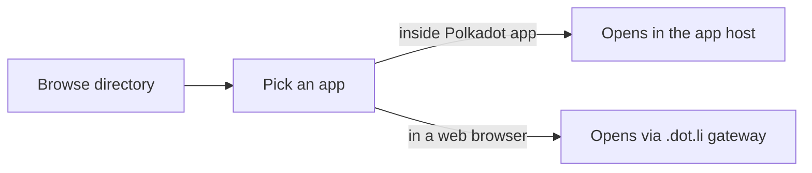

# Getting Started for Users

This path is for trying the Polkadot app as an end user. You will install a
client or use the web gateway, create or import a devnet account, get no-value
funds, and open your first Product by its `.dot` name.

!!! warning "This is a devnet"
    The Polkadot Products Devnet is a preview environment. Devnet tokens have
    **no real value**, and flows may change without notice. Never enter a
    real-value seed phrase, and never share your recovery phrase with anyone.

## What you are using

The Polkadot app is self-custodial: your keys are generated and stored on your
own device. It brings identity, chat, payments, and app discovery into one
client. You can also use the web gateway when you only want to open Devnet apps
from a browser.

- The **Polkadot app** on mobile or desktop, or
- The **web gateway** at [https://dev-dot.li](https://dev-dot.li).

## 1. Install the Polkadot app

Choose the client for your platform.

| Platform | Where to get it |
| --- | --- |
| Android (Google Play) | [play.google.com/store/apps/details?id=io.pcf.polkadotapp](https://play.google.com/store/apps/details?id=io.pcf.polkadotapp) |
| Android (direct APK) | [get.polkadotcommunity.foundation/android/latest.apk](https://get.polkadotcommunity.foundation/android/latest.apk) |
| iOS (TestFlight) | [testflight.apple.com/join/VvC8SHVE](https://testflight.apple.com/join/VvC8SHVE) |
| Desktop (macOS / Windows / Linux) | [polkadotcommunity.foundation/desktop/](https://polkadotcommunity.foundation/desktop/) |

!!! note "Prefer not to install anything?"
    You can browse devnet apps from any web browser through the gateway at
    [https://dev-dot.li](https://dev-dot.li). For the full experience — an
    on-device account, payments, and signing — install one of the clients above.

All installed clients keep your keys on-device. The web gateway is useful for
quick exploration, but the full account, signing, payment, and messaging
experience lives in the app.

## 2. Create or import an account

When you create an account, the app generates a key pair **on your device**.
Your recovery phrase never leaves the device. If you use cloud backup (Google
Drive on Android, iCloud on iOS), treat that backup as sensitive account
material.

To **create a new account**, follow the in-app setup flow and record your
recovery phrase somewhere safe.

To **import an existing devnet account**, choose the import option during setup
and enter its recovery phrase.

!!! warning "Keep secrets on the device"
    Because this is a self-custodial app, only you hold the keys. Anyone with your
    recovery phrase controls the account. Write it down offline and never paste it
    into a website or share it in chat.

## 3. Get devnet funds

The devnet stablecoin is displayed in the app as **CASH**. There are two ways to
obtain it.

### In-app top-up

On devnet builds, the app can top up your account directly. Open the CASH card
and tap **Get CASH**. Once the transfer settles, the CASH card updates and you
can spend the balance inside the app.

!!! note "Devnet-only convenience"
    The **Get CASH** button is available only on non-production networks. See
    [Money (CASH & funding)](../architecture/money.md) for the model behind the
    balance.

### Faucet

You can also request funds from the public faucet at
[https://faucet.polkadot.io](https://faucet.polkadot.io). This is especially
useful when you need native devnet funds for fees.

## 4. Open your first app

Devnet apps are addressed by human-readable **`.dot` names**, for example
`survey.dot`. There are two practical ways to open one.

### From Browse

**Browse** is the app directory for the devnet. It lists the apps currently
published on-chain and lets you open one with a tap.

- In the Polkadot app, open the in-app browser / discovery view.
- In a web browser, visit [https://browse.dev-dot.li](https://browse.dev-dot.li).

When you select an app inside the Polkadot app, it opens in the app host so it
can ask for approvals and use platform services. In a plain web browser, the
same app opens through the `.dot.li` gateway.

### From a `.dot` link

If you already know an app's name, you can open it directly:

- In the Polkadot app, type the `.dot` name (for example `survey.dot`) into the
  browser address bar.
- In a web browser, use the web gateway, e.g. `https://survey.dev-dot.li`.

Some reference apps you can try on the devnet:

| App | Address |
| --- | --- |
| Browse (app directory) | [browse.dev-dot.li](https://browse.dev-dot.li) |
| DotNS (naming) UI | [dotns.dev-dot.li](https://dotns.dev-dot.li) |
| Simple Survey | [survey.dev-dot.li](https://survey.dev-dot.li) |
| CDM Frontend (contracts) | [contracts.dev-dot.li](https://contracts.dev-dot.li) |

## Where to go next

- [Create an account & get funds](../guides/create-account.md)
- [Get & use CASH](../guides/get-and-use-cash.md)
- [Username & proof of personhood](../guides/username-and-personhood.md)
- [Discover & open apps](../guides/discover-and-open-apps.md)
- [Messaging & calls](../guides/messaging-and-calls.md)

## Learn more

- Polkadot app (desktop) source: [github.com/Polkadot-Community-Foundation/polkadot-desktop-community](https://github.com/Polkadot-Community-Foundation/polkadot-desktop-community)
- Polkadot app (Android) source: [github.com/Polkadot-Community-Foundation/polkadot-android-community](https://github.com/Polkadot-Community-Foundation/polkadot-android-community)
- Polkadot app (iOS) source: [github.com/Polkadot-Community-Foundation/polkadot-ios-community](https://github.com/Polkadot-Community-Foundation/polkadot-ios-community)
- Web gateway: [https://dev-dot.li](https://dev-dot.li)
- Official Polkadot developer docs: [https://docs.polkadot.com](https://docs.polkadot.com)
