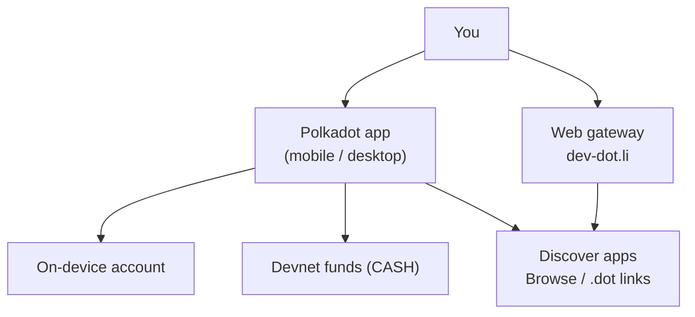

# Getting Started for Users

Install the Polkadot app, create a devnet account, and open your first Product
by its `.dot` domain. This page gets you to the app; the guides take each step
from there.

!!! warning "Never enter a real seed phrase"
    Never type a recovery phrase that holds real value into a devnet build, and
    never share your recovery phrase with anyone.

## What you are using

The Polkadot app is self-custodial: your keys are generated and stored on your
own device, and nothing signs without your approval. It brings identity, chat,
payments, and app discovery into one client. The web gateway is the no-install
option when you only want to open Devnet apps from a browser.

## Install the app

--8<-- "install-app.md"

!!! note "Prefer not to install anything?"
    The gateway at [dev-dot.li](https://dev-dot.li) opens devnet apps in any
    browser. For the full experience — an on-device account, payments, and
    signing — install one of the clients above.

## Then follow the path

1. **[Create an account & get funds](../guides/create-account.md)** — create or
   import an account, protect the recovery phrase, and fund it.
2. **[Get & use CASH](../guides/get-and-use-cash.md)** — top up the spendable
   balance and send it to someone.
3. **[Username & proof of personhood](../guides/username-and-personhood.md)** —
   claim a readable name instead of a long address.
4. **[Discover & open apps](../guides/discover-and-open-apps.md)** — find
   Products in Browse and open them by `.dot` domain.
5. **[Messaging & calls](../guides/messaging-and-calls.md)** — chat and call
   your contacts.
