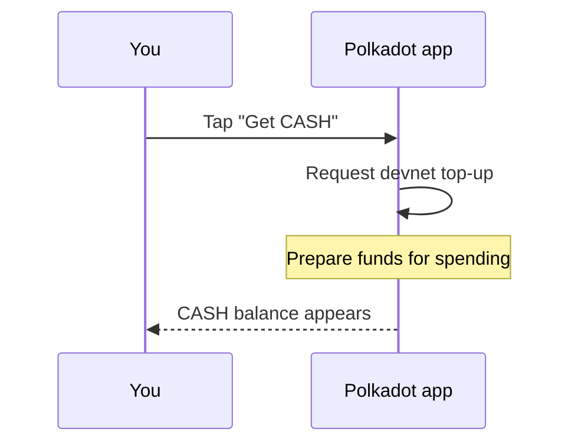

# Create an account & get funds

Create or import an account in the Polkadot app, protect the recovery phrase,
and get enough devnet funds to start using Products on the Polkadot Products
Devnet.

!!! note "This is a devnet"
    The Polkadot Products Devnet is a public developer preview. The tokens you
    receive here have no real value, and flows may change. Never reuse a
    recovery phrase from a real, value-bearing wallet on a devnet.

## 1. Get the app

Install the Polkadot app for the full account, signing, payments, and messaging
experience. Use the web gateway when you only want to open Devnet apps from a
browser.

- Android (Google Play): <https://play.google.com/store/apps/details?id=io.pcf.polkadotapp>
- Android APK (direct): <https://get.polkadotcommunity.foundation/android/latest.apk>
- iOS (TestFlight): <https://testflight.apple.com/join/VvC8SHVE>
- Desktop: <https://polkadotcommunity.foundation/desktop/>
- Web gateway: <https://dev-dot.li>

## 2. Create or import the account

The Polkadot app is **self-custodial**: your keys are generated and stored on
your own device. The app's backend never holds your keys; every signature
happens locally after you approve it.

1. Open the app and choose to **create a new account** if you are starting
   fresh, or **import an existing account** if you already hold a recovery
   phrase.
2. If you create a new account, the app generates a fresh key pair on the
   device.
3. Follow the prompts to back up your recovery phrase. Store it somewhere you
   can recover later, but never somewhere another person or website can read it.

!!! warning "Your recovery phrase is the account"
    Anyone who holds your recovery phrase controls the account, and losing it
    means losing access. Write it down, store it offline, and never paste it
    into a website, a chat, or a support request. The Polkadot app will never
    ask you to share it.

## 3. Get devnet funds

There are two ways to receive devnet funds.

### Use "Get CASH" in the app

On non-production networks the app exposes an in-app top-up. When you tap
**Get CASH**, the app requests a devnet top-up and prepares the funds so they
show up as your **CASH** balance. Some devnet builds also fund a brand-new
account automatically.

CASH is the balance you spend inside the app. For what it is and how to send it,
see [Get & use CASH](get-and-use-cash.md).

### The faucet

You can also request devnet tokens from the public faucet. This is useful when
you need native devnet funds for fees as well as CASH for app flows.

- <https://faucet.polkadot.io>

## If your balance does not appear

A few common reasons a balance may not show up right away:

- **The transaction is still settling.** Funding involves an on-chain transfer
  and, for CASH, an automatic conversion step. Give it a few moments to
  finalize and refresh the balance view.
- **Account minimums and fees.** Like other Substrate-based chains, accounts
  need a small native balance to stay active and pay fees. On this Devnet, keep
  a small **PAS** balance available.
- **Wrong network.** Make sure the app is pointed at the devnet. Balances for
  one network will not appear while you are viewing another.

!!! tip
    If a top-up still does not arrive after retrying, request funds from the
    [faucet](https://faucet.polkadot.io) and confirm you are connected to the
    devnet before troubleshooting further.

## Learn more

- [Get & use CASH](get-and-use-cash.md)
- [Username & proof of personhood](username-and-personhood.md)
- [Money architecture (CASH & funding)](../architecture/money.md)
- Polkadot faucet: <https://faucet.polkadot.io>
- Polkadot developer docs: <https://docs.polkadot.com>
- Polkadot app source: <https://github.com/Polkadot-Community-Foundation/polkadot-android-community>
