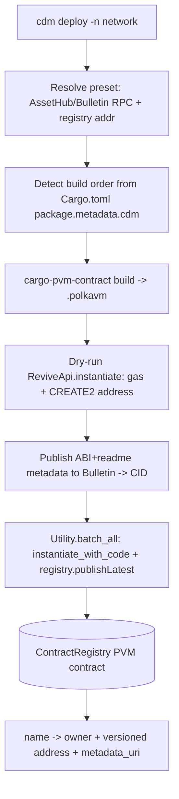

# Deploy & register contracts

Deploy a PolkaVM (PVM) smart contract to the Polkadot Products Devnet and
register it in the Contract Dependency Manager (CDM), so other projects and
frontends can resolve it by name. Smart contracts here run on Asset Hub's
`pallet-revive`: they are PolkaVM bytecode that exposes a Solidity-shaped JSON
ABI and a 20-byte (H160) address.

CDM is the build, deploy, registry, and dependency tool for these contracts. It
compiles Rust PVM contracts, deploys them to Asset Hub, publishes each
contract's metadata (ABI plus readme) to the Bulletin chain as a
content-addressed CID, and records a global `@org/name -> address + metadata`
mapping in an on-chain `ContractRegistry` contract.

## How the pieces fit



The `ContractRegistry` is a single PVM contract per network. Its key methods
include `publishLatest`, `getAddress`, `getMetadataUri`, `getVersionCount`,
`getOwner`, `getContracts` (paged), and `searchContractNames` (prefix). The
first publisher of a name becomes its owner, and only the owner can publish new
versions. Names must match the `@scope/pkg` shape, be ASCII, and be at most 64
bytes.

## Prerequisites

1. Install the CDM CLI:

    ```bash
    npm i -g @polkadot-community-foundation/cdm-cli
    ```

2. Have a funded account on the devnet Asset Hub. You can request tokens from
   the [faucet](https://faucet.polkadot.io).

3. Target the right network. Every CDM command selects one with `-n <name>`
   (also spelled `--name`); this Devnet is `-n devnet`.

!!! note
    The CDM CLI runs TypeScript directly and builds Rust PVM contracts with
    `cargo-pvm-contract`, which the CDM installer sets up (Rust nightly plus
    `rust-src`). See the
    [contract-dependency-manager README](https://github.com/paritytech/contract-dependency-manager)
    for toolchain setup.

## Step 1 — Scaffold and build

A CDM project is a Rust workspace whose contracts declare their package name and
inter-contract dependencies under `[package.metadata.cdm]` in each `Cargo.toml`.
You can start from a template:

```bash
cdm template
cdm build
```

`cdm build` detects the dependency order from the workspace metadata and
compiles each contract to a `.polkavm` artifact.

## Step 2 — Deploy and register

`cdm deploy` performs the whole pipeline: it resolves the network preset,
resolves a signer, maps the deploy account for `pallet-revive`, dry-runs each
instantiation for gas and its deterministic CREATE2 address, publishes each
contract's metadata to Bulletin, and submits the instantiations together with
`registry.publishLatest` in an atomic `Utility.batch_all`.

```bash
cdm deploy -n devnet --suri "<your-secret-uri>"
```

The signer is resolved in the order `--suri` > a saved account for the preset >
the development `Alice` account. One notable option
([`commands/deploy.ts`](https://github.com/paritytech/contract-dependency-manager)):

- `--bootstrap` — deploy the `ContractRegistry` itself first, then all
  workspace contracts. Use this only when standing up a brand-new network that
  has no registry yet.

For the full, current option list, run `cdm deploy --help`.

!!! warning
    A contract name is owned by whoever publishes it first. If you deploy under
    a name someone else already owns, `registry.publishLatest` will reject the
    new version. Choose a `@scope/pkg` name you control.

When the batch is included, each of your contracts has an H160 address on Asset
Hub and a `name -> (owner, versioned address, metadata_uri)` entry in the
registry. You can confirm the entry in the
[CDM Frontend](https://contracts.dev-dot.li), which browses published contracts
by reading the same registry.

## Step 3 — Install a contract into a consumer project

Downstream projects depend on a published contract by name. From a project that
has (or will have) a `cdm.json`:

```bash
cdm install @org/name -n devnet
# or a pinned version:
cdm install @org/name:3 -n devnet
# or install everything listed in cdm.json:
cdm install -n devnet
```

`install` builds a registry handle from `CONTRACTS_REGISTRY_ABI` at the
network's registry address, resolves the version with `getVersionCount`, reads
`getAddress` and `getMetadataUri`, fetches the metadata JSON from the
Bulletin/IPFS gateway by CID, and writes the resolved
`{version, address, abi, metadataCid}` into `cdm.json` under `contracts`
(recording the registry it resolved against). Post-install hooks then generate
TypeScript augmentation (`.cdm/cdm.d.ts`, `.cdm/contracts.d.ts`) and Solidity
import files under `.cdm/solidity/`, and patch your `tsconfig` include so that
typed contract access works
([`commands/install/index.ts`](https://github.com/paritytech/contract-dependency-manager)).

## Step 4 — Resolve the contract from a frontend

At runtime, a frontend resolves a network config that provides a product-SDK
environment, an Asset Hub descriptor, and the registry address (from
`@polkadot-community-foundation/cdm-env`'s `getRegistryAddress`). It then builds a registry handle and
calls the registry getters. This is exactly what the CDM Frontend does:

The shape below is a sketch; treat the CDM Frontend source as the source of
truth for the exact imports and call signatures.

```ts
import {
  createContract,
  createContractRuntimeFromClient,
} from "@parity/product-sdk-contracts";

// networkConfig supplies productSdkEnvironment, an Asset Hub descriptor, and
// registryAddress (from @polkadot-community-foundation/cdm-env's getRegistryAddress). CONTRACTS_REGISTRY_ABI
// is the registry ABI shipped with the CDM libraries.
const runtime = createContractRuntimeFromClient(assetHubClient, assetHubDescriptor);
const registry = createContract(
  runtime,
  networkConfig.registryAddress,
  CONTRACTS_REGISTRY_ABI,
);

// resolve names -> addresses on-chain
const address = await registry.getAddress(/* @org/name */);
```

The exact call shape follows the CDM Frontend's
[`utils/contracts.ts`](https://github.com/paritytech/contract-dependency-manager).
Your contract's ABI comes from the installed `cdm.json` (typed through the
`.cdm` augmentation) or from the Bulletin metadata CID, which lets your app make
typed contract calls.

To install the resolution helpers into a frontend project:

```bash
npm i @polkadot-community-foundation/cdm-env @parity/product-sdk-contracts
```

!!! tip
    The registry address is per-network. Always take it from
    `getRegistryAddress("devnet")` rather than hard-coding it, since it differs
    across networks and can change on a devnet.

## Learn more

- [contract-dependency-manager](https://github.com/paritytech/contract-dependency-manager) — CDM source and toolchain setup
- [CDM Frontend](https://contracts.dev-dot.li) — browse what is already published
- [Smart contracts & CDM](../architecture/contracts.md) — the registry model
