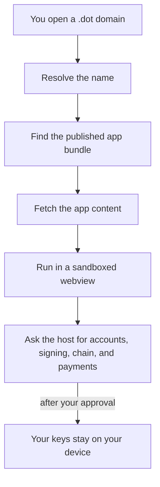

# Discover & open apps

Find Products on the Polkadot Products Devnet and open them from the app, from
Browse, or from a `dev-dot.li` link.

## Ways to reach a Product

There are three practical entry points:

- **Browse** — the app-discovery directory at
  <https://browse.dev-dot.li>. Search and pick from the list.
- **A `.dot` domain** — each published app has a name such as `survey.dot`. On the
  desktop app you can type it into the address bar. The mobile app has no
  general address bar, so on mobile you open apps from Browse or by following a
  `.dot` / `.dev-dot.li` link.
- **A `dev-dot.li` link** — the web gateway serves each app at
  `https://<name>.dev-dot.li` (for example
  <https://survey.dev-dot.li>). Open it in an ordinary browser.

You reach the platform through the Polkadot app (mobile and desktop) or the web
gateway at <https://dev-dot.li>. If you do not have the app yet,
[Get the app](../reference/resources.md#get-the-app) has the Android, iOS and
desktop downloads.

## Find Products in Browse

Browse is a directory of the apps currently published on the network. You cannot
publish an app from Browse, but when you are signed in you can recommend (attest
to) and bookmark apps, so it is not strictly read-only.

1. Open <https://browse.dev-dot.li>, or find **Browse** inside the Polkadot app.
2. Use search and categories to narrow the list. Each app is shown with a name,
   description, and icon.
3. Some cards carry certificate badges. Treat them as extra context, not as a
   reason to lower your caution on a devnet.
4. Select a card to open the app.

Browse reads the Devnet publishing registry and the names attached to published
apps. For the technical path behind that list, see
[Discovery architecture](../architecture/discovery.md).

## Open an app by `.dot` domain

On the **desktop** app you can go straight to a name:

1. Type the app's name — for example `survey.dot` — into the address bar. (The
   mobile app has no general address bar; on mobile, open the app from Browse or
   by following a link instead.)
2. The app resolves the name, fetches the app bundle, and opens it in a
   sandboxed webview.

If you are in an ordinary web browser instead, use the gateway form of the same
name: `https://survey.dev-dot.li`.

## When a name does not resolve

The gateway resolves names in the browser, so every `<name>.dev-dot.li` address
serves the same Polkadot loader shell first — a typo, an unpublished name and a
working app look identical until resolution completes. If the shell never hands
over to an app, check the spelling, then look the name up in
<https://browse.dev-dot.li>: a name that is not listed there is not published.

## Reference apps to try

These apps are deployed on the devnet and are a good starting point:

--8<-- "reference-apps.md"

## What happens when you open an app

When you open an app, the client turns the name into content and runs that
content in an isolated container:

Two properties matter for you as a user:

- **The app is sandboxed.** Each app runs in its own isolated webview and cannot
  read another app's data or reach your keys directly.
- **You approve every action.** When an app needs a signature or a payment, the
  Polkadot app shows you a prompt, and the on-device key signs only after you
  approve. Your recovery phrase and private keys never leave your device.

!!! tip "Opening one app from another"
    Inside the Polkadot app, app-to-app navigation stays inside the host. In a
    plain browser, the same action opens the app at its
    `https://<name>.dev-dot.li` address.

## Learn more

- [App discovery (Browse)](../architecture/discovery.md) — how the directory is built
- [Create an account & get funds](create-account.md) — needed before most apps do anything
