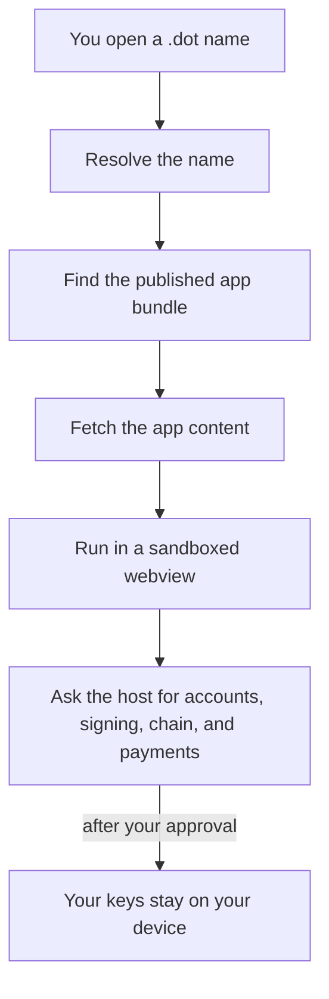

# Discover & open apps

Find Products on the Polkadot Products Devnet and open them from the app, from
Browse, or from a `dev-dot.li` link.

!!! note "This is a devnet"
    The Polkadot Products Devnet is a public developer preview. Any tokens you
    hold here have no real value, and flows may change as the platform evolves.

## Ways to reach a Product

There are three practical entry points:

- **Browse** — the app-discovery directory at
  <https://browse.dev-dot.li>. Search and pick from the list.
- **A `.dot` name** — each published app has a name such as `survey.dot`. You
  can type it into the Polkadot app's browser.
- **A `dev-dot.li` link** — the web gateway serves each app at
  `https://<name>.dev-dot.li` (for example
  <https://survey.dev-dot.li>). Open it in an ordinary browser.

You reach the platform through the [Polkadot app](https://play.google.com/store/apps/details?id=io.pcf.polkadotapp)
(mobile and desktop) or the web gateway at <https://dev-dot.li>. If you do not
have the app yet, see [Create an account & get funds](create-account.md) for
install links.

## Find Products in Browse

Browse is a read-only directory of the apps currently published on the network.

1. Open <https://browse.dev-dot.li>, or find **Browse** inside the Polkadot app.
2. Use search and categories to narrow the list. Each app is shown with a name,
   description, and icon.
3. Some cards carry certificate badges. Treat them as extra context, not as a
   reason to lower your caution on a devnet.
4. Select a card to open the app.

Browse reads the Devnet publishing registry and the names attached to published
apps. For the technical path behind that list, see
[Discovery architecture](../architecture/discovery.md).

## Open an app by `.dot` name

Inside the Polkadot app's browser you can go straight to a name:

1. Type the app's name — for example `survey.dot` — into the address bar.
2. The app resolves the name, fetches the app bundle, and opens it in a
   sandboxed webview.

If you are in an ordinary web browser instead, use the gateway form of the same
name: `https://survey.dev-dot.li`.

## Reference apps to try

These apps are deployed on the devnet and are a good starting point:

| App | Link |
| --- | --- |
| DotNS UI (manage `.dot` names) | <https://dotns.dev-dot.li> |
| Simple Survey | <https://survey.dev-dot.li> |
| Playground template | <https://playground-template.dev-dot.li> |
| CDM Frontend (contracts) | <https://contracts.dev-dot.li> |

## What happens when you open an app

When you open an app, the client turns the name into content and runs that
content in an isolated container:

Two properties matter for you as a user:

- **The app is sandboxed.** Each app runs in its own isolated webview and cannot
  read another app's data or reach your keys directly.
- **You approve every action.** When an app needs a signature or a payment, the
  Polkadot app shows you a prompt, and the on-device key signs only after you
  approve. Your recovery phrase and private keys never leave your device.

!!! tip "Opening one app from another"
    Inside the Polkadot app, app-to-app navigation stays inside the host. In a
    plain browser, the same action opens the app's web-gateway link instead.

## Learn more

- [Discovery architecture](../architecture/discovery.md)
- [Naming architecture (DotNS)](../architecture/naming.md)
- [App delivery architecture](../architecture/app-delivery.md)
- [Create an account & get funds](create-account.md)
- Browse source: <https://github.com/paritytech/browse>
- Polkadot developer docs: <https://docs.polkadot.com>
