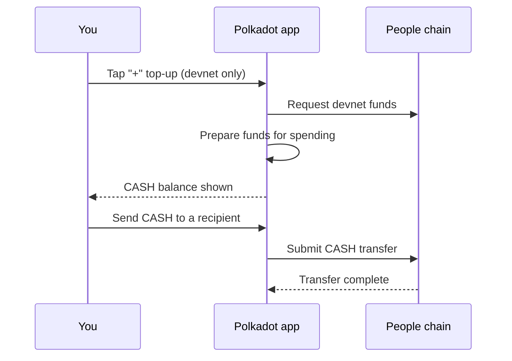

# Get & use CASH

CASH is the spendable balance you see inside the Polkadot app on the Polkadot
Products Devnet. It has no real-world value, but it lets you try the real user
flow: receive funds, see a balance, and send value to another account.

## Before you start

To follow this guide without hitting a wall, have these ready first:

- **An account.** CASH lives in your Polkadot app account. If you do not have one
  yet, create or import it first — see [Create an account & get funds](create-account.md).
- **Native tokens for fees — needed to *send* CASH.** Topping up CASH with the
  in-app **"+"** button costs you nothing. But *sending* or spending CASH submits
  an on-chain transaction on the People chain, which needs a small amount of PAS
  to pay fees. Fund it from the faucet first — see
  [Fund the account from the faucet](create-account.md#fund-the-account-from-the-faucet).
- **The mobile app.** The **"+"** top-up is on the mobile app (devnet builds);
  the desktop app has no CASH card.

## What CASH is

"CASH" is the name the app uses for the Devnet digital-dollar balance. The app
presents it as a simple spendable balance, while the platform handles the
chain-specific work behind the scenes.

For developers, the useful detail is that CASH is spent through **Coinage** on
the People chain, and the same logical asset can also be represented on Asset
Hub with asset id `50000413`. For users, the important rule is simpler: if the
CASH card shows a balance, you can use it in app payment flows.

## Get CASH

You have a few ways to acquire CASH on the devnet.

### 1. The in-app "+" top-up button (mobile)

On devnet builds the app can top your account up directly. This is the fastest
path. The desktop app has no CASH card and no top-up flow — fund your account on
the mobile app.

1. Open the Polkadot app on mobile (Android or iOS).
2. Open your Pocket, go to the CASH card, and tap the **"+"** (top-up) button
   next to **Get CASH**. (The **"+"** top-up button appears only on
   non-production / devnet builds.)
3. The app requests a devnet top-up and prepares the funds for spending.
4. The deposit settles in a few seconds and the CASH card shows the new balance.
   If it has not moved after a minute, reopen the Pocket to refresh the view and
   tap **"+"** again.

!!! tip "You fund your account yourself"
    New accounts are not funded automatically. Tap the **"+"** top-up on the CASH
    card (devnet builds) to add test CASH. The faucet is a separate step, and it
    pays PAS for fees rather than CASH.

### 2. Earn it

CASH can also be earned through Devnet reward flows, such as games, judgements,
invitations, or prize events. When rewards are paid out, they appear in the same
CASH balance as funds from the top-up flow.

## Send & use CASH

Once you hold CASH you can send it to another user.

1. Open your CASH card and choose **Send CASH**.
2. Enter the recipient and the amount.
3. Review and confirm the action. The app prepares the transfer, asks for your
   approval, submits it, and waits for settlement before reporting success.

Because CASH transfers move value, always check the recipient and amount before
you approve.

!!! note "On desktop, CASH lives in chat"
    The desktop app has no CASH card or **Get CASH** button. On desktop you send
    and receive CASH inside chat conversations, not from a card. Fund your
    account on the mobile app first.

!!! note "Where the value lives"
    Spending CASH is separate from the native token used for fees. Keep a small
    amount of native devnet funds available so your account can stay active and
    pay transaction fees.

## Learn more

- [Create an account & get funds](create-account.md)
- [Money (CASH & funding)](../architecture/money.md) — why CASH and PAS are separate
