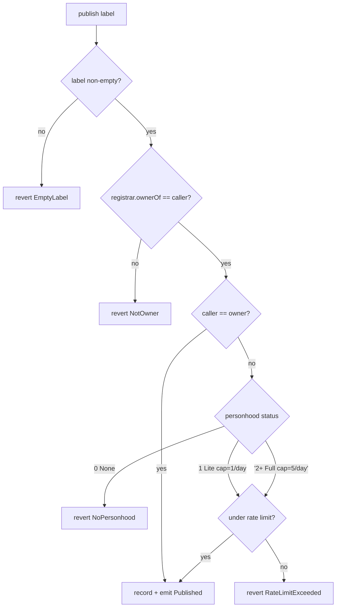
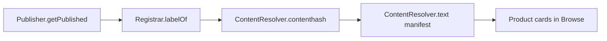

# List your app in Browse

Browse is the app-discovery directory for the Polkadot Products Devnet. Listing
your app means publishing a small on-chain record that points directory clients
back to the `.dot` domain and its manifest. This page covers the permission model,
the CLI path, and how to verify or retract a listing.

!!! note "This is a devnet"
    The Polkadot Products Devnet is a public developer preview. Devnet tokens
    have no real value, and flows may change. Never paste a recovery phrase,
    seed, or private key into a command line or a website.

## What "listing" actually is

Browse is deliberately minimal. Listing your app records almost nothing
on-chain: the `Publisher` registry contract stores only a labelhash, the
publisher address, and a timestamp. All of the display metadata that Browse
shows — the app's name, description, and icon — is read from a DotNS `manifest`
text record and content stored on the Bulletin Chain / IPFS, and joined back to
the on-chain entry by labelhash in the client.

That means listing has two parts:

1. Your app is already deployed to a `.dot` domain (its content root is written as
   a `contenthash`, and a root `manifest` text record carries the display
   metadata).
2. You call `Publisher.publish("<label>")` so directory clients like Browse can
   enumerate the app.

The Browse client (`@parity/browse-client`) never publishes; it only reads. It
pages the published set across every configured `Publisher` deployment,
resolves labelhashes back to labels via the DotNS registrar, hydrates the
manifest and any attestations through Multicall3, and renders product cards.
Opening a card navigates into the app either through the Polkadot app host or a
`.dot.li` web gateway fallback.

## The permission model

Publishing is gated on-chain. A non-owner caller must satisfy three conditions:

- **Ownership of the `.dot` label.** The contract hashes `<label>` to its
  namehash and requires `registrar.ownerOf(<label>.dot) == msg.sender`. An
  unminted name or the wrong owner reverts with `NotOwner`. This applies to both
  publish and unpublish.
- **Proof of personhood.** The contract calls the personhood precompile for the
  `dotns` context. Status `0` (none) reverts with `NoPersonhood`; status `1`
  (Lite) allows up to **1 publish per rolling 24 hours**; status `2` and above
  (Full) allows up to **5 per rolling 24 hours**.
- **The rate limit.** Exceeding your tier's cap within the window reverts with
  `RateLimitExceeded`.

The contract `owner()` account bypasses both the personhood gate and the rate
limit, so the operator running the network can seed listings freely. For your
own app you go through the gated path.



## Before you start

You will need:

- A built static bundle for your app (for example a Vite `dist/` directory).
- A `.dot` domain you own on the devnet, and proof of personhood on the account
  that will publish. See [Username & proof of personhood](username-and-personhood.md).
- The deploy CLI installed:

    ```bash
    npm i -g @parity/polkadot-app-deploy
    ```

    This installs the `pad` (and `polkadot-app-deploy`) binary. Listing support
    was added to this CLI via the `--publish` flag, so use a recent version.

- The env name for the devnet you are targeting. `pad` takes it via
  `--env <network>`; the concrete preset id is provided by the team operating
  the network. The `--publish` step only takes effect on an environment that has
  a `Publisher` contract deployed.

!!! note "Metadata comes from a manifest"
    Browse shows your app using a root manifest with `displayName`,
    `description`, and an `icon`. The deploy CLI writes these `manifest` text
    records when it finds a `polkadot-app-deploy.config` alongside your build.
    If your app has no manifest, it can still be published, but it will not
    hydrate into a rich card.

## Step 1 — Deploy your app to its `.dot` domain

If your app is not deployed yet, deploy it first. The CLI merkleizes your
bundle, uploads it to the Bulletin Chain, and writes the content root as the
`contenthash` on DotNS:

```bash
pad ./dist my-app.dot --env <network>
```

When a `polkadot-app-deploy.config` is present, this same run also writes the
root and per-executable `manifest` text records that Browse reads.

!!! warning "Never print secrets"
    Supply the signing key using your CLI's documented option (check
    `pad --help`), prefer an environment variable over an inline argument where
    possible, and never commit it. The signer must own the `.dot` label you are
    publishing.

## Step 2 — Publish the listing

You can list the app as part of a deploy by adding `--publish`:

```bash
pad ./dist my-app.dot --env <network> --publish
```

After the contenthash is set, this calls `Publisher.publish("my-app")`. On an
environment that has no `Publisher` contract configured, the publish step is
skipped rather than failing the deploy.

Publishing is idempotent. Re-running it on an already-listed label refreshes the
publisher and timestamp in place rather than creating a duplicate entry, so it
is safe to include `--publish` on every deploy.

## Step 3 — Verify it appears

Open the Browse reference app and search for your app:

- <https://browse.dev-dot.li>

The client enumerates the published set, resolves your label, and hydrates the
card from your manifest. Selecting the card opens the app — inside the Polkadot
app it navigates to `my-app.dot`; in a plain browser it opens the app through
the web gateway.



## Removing a listing

To retract a listing, unpublish it. This is a standalone operation that skips
the deploy:

```bash
pad --unpublish my-app.dot --env <network>
```

Unpublishing only requires ownership of the label — there is no personhood gate
or rate limit on removal.

## Learn more

- Browse reference app (devnet): <https://browse.dev-dot.li>
- [Build and publish your app](build-and-publish.md)
- [Register a `.dot` domain](register-a-dot-name.md)
- [Discover and open apps](discover-and-open-apps.md)
- [App delivery architecture](../architecture/app-delivery.md)
- [Discovery architecture](../architecture/discovery.md)
- [Naming (DotNS) architecture](../architecture/naming.md)
- Browse source: <https://github.com/paritytech/browse>
- Deploy CLI source: <https://github.com/paritytech/polkadot-app-deploy>
- npm: <https://www.npmjs.com/package/@parity/polkadot-app-deploy>
- Polkadot developer docs: <https://docs.polkadot.com>
