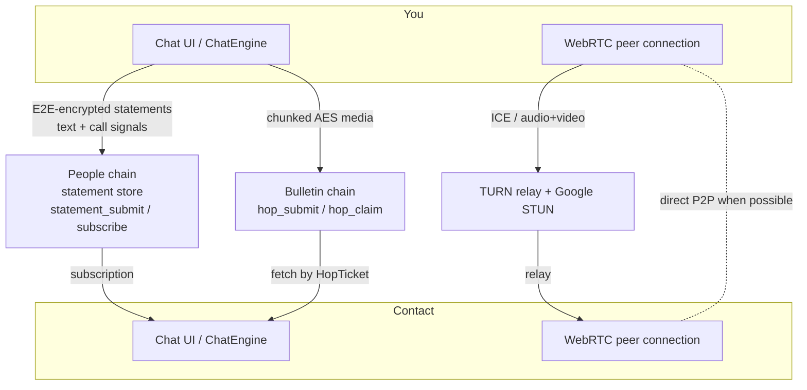
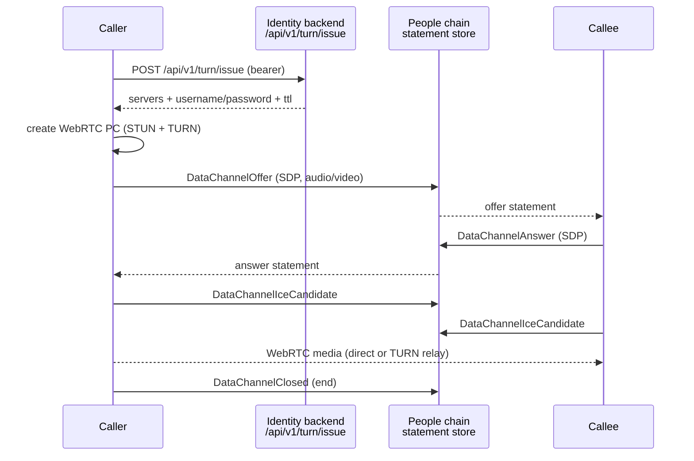

# Messaging & calls

The Polkadot app includes a built-in, self-custodial messenger. You can hold
one-to-one chats, send media, and place voice or video calls to your contacts —
without a central chat database that reads your messages. Text and call
signaling travel as encrypted statements; attachments and live media use the
supporting transport described below.

This page covers the user-facing flow and the current limits of each client.

!!! note
    This is the Polkadot Products Devnet, a public developer preview. Devnet
    tokens have no real value and flows may change between builds.

## Before you start

You will need the Polkadot app installed and an on-device account:

- Android (Play): <https://play.google.com/store/apps/details?id=io.pcf.polkadotapp>
- Android APK: <https://get.polkadotcommunity.foundation/android/latest.apk>
- iOS (TestFlight): <https://testflight.apple.com/join/VvC8SHVE>
- Desktop: <https://polkadotcommunity.foundation/desktop/>

Messaging is tied to your on-chain identity, so both you and the person you want
to reach need an account and, in practice, to have added each other as a
contact.

!!! tip
    Voice and video call initiation is a mobile-app feature. On Desktop you can
    take part in chats and see call state (ringing, active, missed), but calls
    are started from Android or iOS.

## How messaging works

The messenger has no dedicated plaintext messaging backend. It uses two Polkadot
chains as transport, plus WebRTC for live media:

- **Text messages and call signaling** are SCALE-encoded, end-to-end encrypted,
  and delivered through the [Polkadot statement store](https://docs.polkadot.com)
  on the People chain over JSON-RPC (`statement_submit` /
  `statement_subscribeStatement`).
- **Media attachments** (images, video, files) do not go through the statement
  store. They are chunked, AES-encrypted, and stored on the Bulletin Chain via a
  "hop" RPC API (`hop_submit` / `hop_claim` / `hop_ack`); the chat message only
  carries a reference (a `HopTicket`) so the recipient can fetch and decrypt the
  file.
- **Voice and video calls** use WebRTC directly between the two devices. There is
  no signaling server: the SDP offer/answer and ICE candidates are sent as
  ordinary encrypted chat messages over the same statement-store channel.

Encryption is per peer: the app derives a shared secret via ECDH between your key
and your contact's key, runs it through HKDF-SHA256, and uses the result to
AES-encrypt each message. The chain sees only ciphertext.

## Start a chat and send messages

1. Open the app and go to the chats section.
2. Add or select a contact. Contacts are keyed to their on-chain identity, so you
   are messaging an account, not a phone number or email address.
3. Type your message and send it. Under the hood the app builds a SCALE
   `Text` message, encrypts it with the per-peer key, and submits it as a
   statement to the People chain. Delivery is retried until the statement is
   accepted.
4. Your contact's app is subscribed to the statement store, receives the
   statement, decrypts it, and displays the message.

The chat protocol also supports replies, reactions, and in-chat token transfers,
which are carried as distinct message types over the same encrypted channel.

## Send media

1. In a chat, attach an image, video, or file.
2. The app picks a Bulletin Chain hop node, chunks the file, and AES-encrypts it
   before upload via `hop_submit`.
3. A reference to the stored file (a `HopTicket` plus the node URL) is embedded in
   a normal encrypted chat message.
4. Your contact receives the message, fetches the encrypted chunks from the
   Bulletin Chain, and decrypts them locally.

!!! note
    Attachment sending is a mobile-app capability. Desktop participates in chats,
    but its own attachment-sending support is not yet available.

## Place a voice or video call

Calls are placed from the mobile app.

1. Open a chat with the contact you want to call and start an audio or video call.
2. The app creates a WebRTC peer connection. To traverse NATs it uses Google's
   public STUN servers plus a TURN relay. On Android, short-lived TURN
   credentials are fetched from the identity backend
   (`POST /api/v1/turn/issue`); if that request fails, the call falls back to
   STUN-only.
3. The app sends an SDP offer to your contact as a `DataChannelOffer` chat
   message (marked as an audio or video call). Your contact's app replies with a
   `DataChannelAnswer`, and both sides exchange `DataChannelIceCandidate`
   messages — all over the encrypted statement-store channel.
4. Once ICE negotiation completes, audio and video flow peer to peer over WebRTC,
   either directly or relayed through TURN. Ending the call sends a
   `DataChannelClosed` message.

On Desktop, incoming call state is folded from the same call-signal messages and
shown in the chat UI (ringing, active, finished, cancelled, missed).

## Device sync

Desktop and mobile can keep contacts and chats in sync over an encrypted
peer-to-peer channel. The two devices establish a WebRTC data channel — signaling
the offer, answer, and ICE candidates through the same People-chain statement
store — and replicate contacts and chats once the channel opens. TURN, where
used, is configured client-side.

## Limits and honesty

- Voice/video call initiation is a mobile feature; Desktop is receive/display
  only, and Desktop attachment sending is not yet available.
- Whether a specific call is peer-to-peer or TURN-relayed depends on your
  network; the app degrades gracefully to relaying when a direct path is not
  possible.
- This is a devnet. Identities, messages, and flows are for evaluation and may
  change.

## Learn more

- Polkadot Android (source): <https://github.com/Polkadot-Community-Foundation/polkadot-android-community>
- Polkadot Desktop (source): <https://github.com/Polkadot-Community-Foundation/polkadot-desktop-community>
- Polkadot iOS (source): <https://github.com/Polkadot-Community-Foundation/polkadot-ios-community>
- Polkadot developer docs: <https://docs.polkadot.com>
- Web gateway: <https://dev-dot.li>
