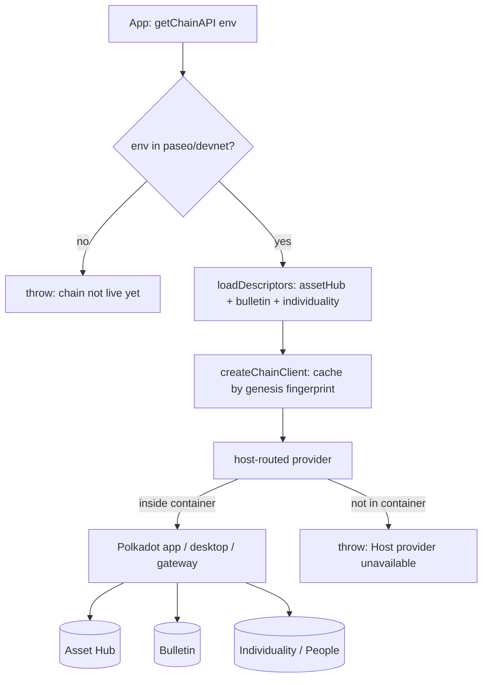

# Use platform services from the SDK

Use the **Product SDK** (`@parity/product-sdk`) from app code to reach the
platform services most apps need first: chain access, cloud storage,
smart-contract calls, and a user's identity / proof-of-personhood status.
[Packages & tools](../reference/packages.md) has the install line.

## Before you start

The SDK is a TypeScript umbrella package with subpath entry points you import
from directly: `./chain`, `./cloud-storage`, `./contracts`, `./identity`,
`./host`, `./wallet`, `./local-storage`, `./crypto`, `./address`, `./react`, and
`./testing`. `./react` (`ProductSDKProvider`, `useChain`, `useWallet`,
`useLocalStorage`, `useProductSDK`) declares `react` `^18 || ^19` as a peer
dependency — a project without React installed gets a module-not-found error on
that subpath only.

!!! warning "The SDK runs inside the host container"
    Every chain call and every storage call is routed through the host
    container — the Polkadot app (mobile or desktop) or the web gateway at
    [dev-dot.li](https://dev-dot.li). Outside a container, `createApp()` itself
    throws while initialising local storage, before you reach any service:

    ```
    Host storage unavailable. Ensure you are running inside a host container
    (Polkadot Browser / Desktop).
    ```

    A chain call made outside a container throws
    `Host provider unavailable for chain <genesisHash>`. To exercise your app in
    CI, use the [test host](#test-without-the-real-host).

**Operations that can fail return a `Result` instead of throwing.**
`Result<T, E>` is `{ ok: true; value: T } | { ok: false; error: E }`, so check
`res.ok` before reading `res.value`. `ok`, `err` and `isErrorOf` are exported
from the package root. Every sample below follows this shape.

## Connect to the chains

The chain client gives you typed PAPI access to the three platform chains:
**Asset Hub**, the **Bulletin** chain, and the **Individuality / People** chain.
There are two ways to connect.

**Zero-config preset.** Call `getChainAPI(env)` and let the SDK load the right
descriptors for you:

```ts
import { getChainAPI } from "@parity/product-sdk/chain";

const client = await getChainAPI("devnet");

const account = await client.assetHub.query.System.Account.getValue(address);
const fee = await client.bulletin.query.TransactionStorage.ByteFee.getValue();
client.individuality; // People-chain access
client.raw; // lower-level PAPI handles, keyed by chain name
client.destroy(); // tear the connections down when you are finished
```

`Environment` has four values — `polkadot`, `kusama`, `paseo` and `devnet` — so
all four typecheck. `polkadot` and `kusama` throw at runtime because their
Bulletin and Individuality chains are not live yet; the throw is per chain, not
per environment. Connections are cached by each chain's genesis-hash
fingerprint.

**Bring your own descriptors.** For a specific or pre-release chain, pass
descriptors yourself. They live in `@parity/product-sdk-descriptors`, which is a
separate install (`npm i @parity/product-sdk-descriptors`) — it is not pulled in
by `@parity/product-sdk`:

```ts
import { createChainClient } from "@parity/product-sdk/chain";
import { devnet_asset_hub } from "@parity/product-sdk-descriptors/devnet-asset-hub";
import { devnet_bulletin } from "@parity/product-sdk-descriptors/devnet-bulletin";

const client = await createChainClient({
  chains: { assetHub: devnet_asset_hub, bulletin: devnet_bulletin },
});
```

`createChainClient` is async — without the `await` the failure surfaces later,
as a `Property 'assetHub' does not exist on type 'Promise<ChainClient<…>>'`
error on the next line you write.

!!! warning "The descriptor chooses the chain"
    A descriptor passed to `createChainClient` **is** the network selection —
    passing `paseo_asset_hub` here connects your app to Paseo Next, not this
    Devnet, whatever `--env` you deployed with. The failure is quiet: the app
    builds and loads, then throws `ChainNotSupportedError` at runtime. Match the
    descriptor prefix to your target network.



## Sign transactions

Signing goes through the host wallet, not through keys you manage. Connecting
returns a `Result` carrying the available accounts; `getSigner()` returns a
standard PAPI `PolkadotSigner`, but only once an account is selected:

```ts
import { SignerManager } from "@parity/product-sdk/wallet";

const manager = new SignerManager();
const connected = await manager.connect(); // or connect("dev") for Alice/Bob
if (!connected.ok) throw connected.error;

const [account] = connected.value;
if (!account) throw new Error("Host wallet returned no accounts");

manager.selectAccount(account.address);
const signer = manager.getSigner(); // PolkadotSigner | null
```

Because `connect()` reports failure on the `err` channel rather than throwing, a
missed check leaves you with a `null` signer and no error to explain it.

## Store and retrieve data (Cloud Storage)

Cloud Storage is content-addressed storage backed by the Polkadot Bulletin
chain. Store bytes, get back a root CID, read them back by CID. Uploads need a
connected wallet with a selected account:

```ts
import { createApp } from "@parity/product-sdk";

const app = await createApp({
  name: "my-app",
  cloudStorage: { environment: "devnet" },
});

const cloud = app.cloudStorage;
if (!cloud) throw new Error("Cloud Storage is disabled");

const uploaded = await cloud.upload(bytes);
if (!uploaded.ok) throw uploaded.error;

const fetched = await cloud.fetch(uploaded.value);
if (fetched.ok) {
  render(fetched.value); // Uint8Array
}
```

!!! warning "`cloudStorage.environment` defaults to `paseo`"
    Omit the option and your app reads and writes Bulletin on Paseo, not on this
    Devnet — a different chain, so your data is simply not where you expect it
    and nothing errors. The only two values are `paseo` and `devnet`. Passing
    `cloudStorage: false` disables the service, which is what makes
    `app.cloudStorage` nullable.

`cloud.computeCid(data)` computes a CID without uploading (`calculateCid` from
the package root does the same without an `App`). Reads are container-only —
there is no IPFS-gateway fallback.

## Call smart contracts

Contracts on the devnet are PolkaVM bytecode running on Asset Hub via
`pallet-revive`, exposing Solidity-shaped ABIs. Build a runtime from a raw PAPI
client, then a typed contract handle:

```ts
import {
  createContract,
  createContractRuntimeFromClient,
} from "@parity/product-sdk/contracts";

// client and manager as above; address and abi come from your CDM package.
const runtime = createContractRuntimeFromClient(client.raw.assetHub, devnet_asset_hub);
const contract = createContract(runtime, address, abi, { signerManager: manager });
```

The argument order is `(runtime, address, abi)` — address first. The optional
fourth argument supplies the signer: pass `{ signerManager }` for `.tx()` calls,
which resolve the selected account at call time. Read-only `.query()` calls need
no account and fall back to the keyless `QUERY_FALLBACK_ORIGIN`.
`ensureContractAccountMapped(runtime, address, signer)` maps an account for
`pallet-revive` when a call requires it.

To resolve a contract's address and ABI from a package name, see
[Deploy & register contracts (CDM)](deploy-contracts-cdm.md), which the
[CDM Frontend](https://contracts.dev-dot.li) also uses at runtime.

## Read identity and personhood

To prove a user controls a `.dot` identity, sign with the account that owns it.
The wallet resolves the username's owner on the People chain and signs with that
account:

```ts
import { devnet_individuality } from "@parity/product-sdk-descriptors/devnet-individuality";

const proof = await app.wallet.signMessageWithDotNsIdentity({
  peopleChain: devnet_individuality,
  username: "alice", // omit to use the user's primary .dot name
  message: "Sign in to my-app",
});

proof.username; // username used for the lookup
proof.accountId; // owning AccountId32, 0x-prefixed
proof.signature; // Uint8Array
```

Usernames are matched byte-for-byte against the chain's records, with no `.dot`
suffix handling — pass the exact value that is registered. Omitting `username`
triggers a host identity-permission prompt. If your app already connects the
People chain with `app.chain.connect({ … })`, the lookup reuses that connection.

For privacy-preserving identifiers, derive an alias instead of exposing an
address. `deriveContextAlias(parentAddress, context)` is deterministic and
checkable with `verifyContextAlias`; `deriveAnonymousAlias(context,
ringLocation)` produces a Ring VRF alias that cannot be linked back to the
parent account:

```ts
import { deriveContextAlias } from "@parity/product-sdk/identity";

const alias = deriveContextAlias(account.address, "voting-round-1");
alias.address; // SS58 alias
alias.h160Address; // the same alias as an EVM address
```

Both are per-context, so the same user is a different alias in every app.
`isValidDotNsName` and `normalizeDotNsName` validate and canonicalise a name
before you use it.

For the raw host session — login state, product accounts, ring proofs — call
`getAccountsProvider()` from `@parity/product-sdk/host`. It is async and
resolves to `null` outside a host container, and its methods return neverthrow
`ResultAsync` values (`.isOk()`), not the SDK's own `Result`.

To read a user's **personhood tier** on-chain, call the `personhood`
`pallet-revive` precompile at the fixed address
`0x000000000000000000000000000000000A010000` with a contract handle. Its
`personhoodStatus(account, bytes32 context)` returns a status
(`0 = None`, `1 = Lite`, `2 = Full`) and a per-application `contextAlias`. See
the [Identity & personhood architecture](../architecture/identity.md) page for
the full model.

## Test without the real host

`@parity/host-api-test-sdk` is a thin Playwright host that speaks the real host
protocol with auto-signed dev accounts, so you can drive your app end-to-end in
CI. It needs `@playwright/test` as a peer, and the fixture lives on the
`/playwright` subpath:

```bash
npm i -D @parity/host-api-test-sdk @playwright/test
```

```ts
import { test as base } from "@playwright/test";
import {
  createTestHostFixture,
  type TestHost,
} from "@parity/host-api-test-sdk/playwright";

const test = base.extend<{ testHost: TestHost }>(
  createTestHostFixture({
    productUrl: "http://localhost:5173",
    accounts: ["alice"],
  }),
);

test("signs a transfer", async ({ testHost }) => {
  await testHost.waitForConnection();
  await testHost.productFrame().getByRole("button", { name: "Send" }).click();

  const signed = await testHost.getSigningLog();
  // assert on what the host was asked to sign
});
```

The fixture embeds your product in an iframe, injects the dev accounts,
auto-signs signing requests, and proxies chain RPC over WebSocket.
`switchAccount`, `getSigningLog` and the permission / chat / payment logs let
tests assert on host behaviour. The shipped `networks` presets are
`PASEO_ASSET_HUB` (the default), `PREVIEWNET` and `PREVIEWNET_ASSET_HUB` — to
point the test host at this Devnet, pass your own `NetworkConfig`
(`{ id, name, genesisHash, rpcUrl, tokenSymbol, tokenDecimals }`) built from
[Networks & endpoints](../reference/networks.md).

## Learn more

- [product-sdk](https://github.com/paritytech/product-sdk) — SDK source
- [Deploy & register contracts (CDM)](deploy-contracts-cdm.md) — resolve a contract by name
- [Identity & personhood](../architecture/identity.md) — the model behind the precompile
