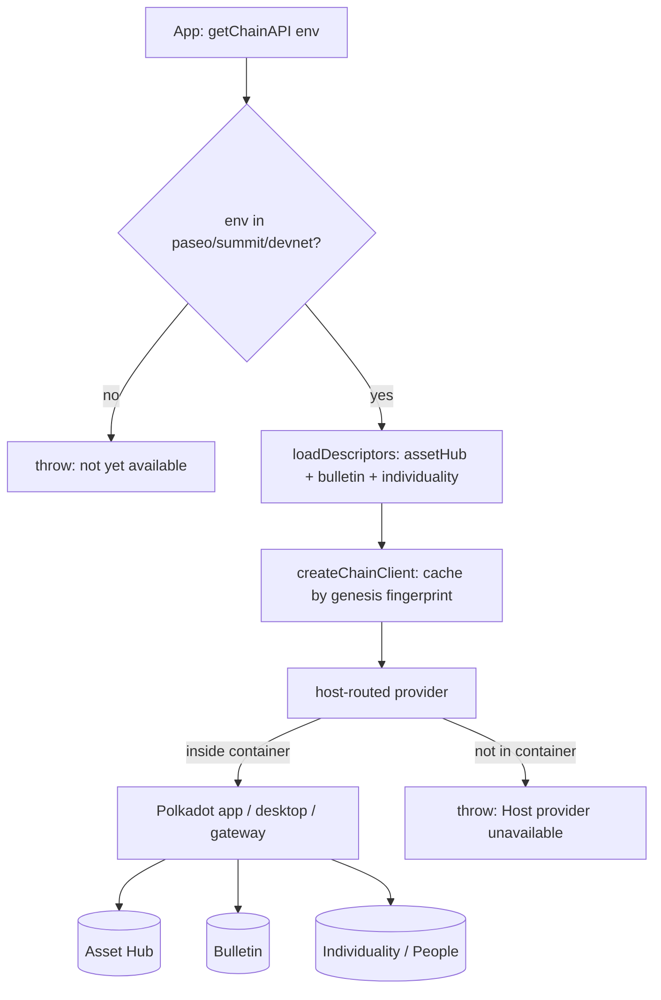

# Use platform services from the SDK

Use the **Product SDK** (`@parity/product-sdk`) from app code to reach the
platform services most apps need first: chain access, cloud storage,
smart-contract calls, and a user's identity / proof-of-personhood status.

## Before you start

Install the SDK into your app:

```bash
npm i @parity/product-sdk
```

The Product SDK is a TypeScript umbrella package (v0.17.0) that re-exports a
family of `@parity/product-sdk-*` workspaces. It exposes subpath entry points
you can import from directly, including `./chain`, `./cloud-storage`,
`./contracts`, `./identity`, `./host`, `./wallet`, `./local-storage`,
`./crypto`, `./address`, `./react`, and `./testing`.

!!! warning "The SDK runs inside the host container"
    Every chain RPC call is routed through the host container — the Polkadot app
    (mobile or desktop) or the web gateway at
    [dev-dot.li](https://dev-dot.li). Outside a host container the chain client
    throws `Host provider unavailable`, and cloud-storage reads throw
    `CloudStorageHostUnavailableError`. The SDK is not designed to run
    standalone. To exercise your app in CI without the real host, use
    [`@parity/host-api-test-sdk`](#test-without-the-real-host).

## Connect to the chains

The chain client gives you typed PAPI access to the three
platform chains: **Asset Hub**, the **Bulletin** chain, and the
**Individuality / People** chain. There are two ways to connect.

**Zero-config preset.** Call `getChainAPI(env)` from `@parity/product-sdk-chain-client`
and let the SDK load the right descriptors for you:

```ts
import { getChainAPI } from "@parity/product-sdk/chain";

const client = await getChainAPI("devnet");

// Typed queries per chain:
await client.assetHub.query; /* ... */
await client.bulletin.query; /* ... */
client.individuality; /* People-chain access */
client.raw; /* lower-level PAPI handles */
```

Only the live environments `paseo`, `summit`, and `devnet` are accepted; other
values throw a "not yet available" error. The client caches connections by each
chain's genesis-hash fingerprint.

**Bring your own descriptors.** If you need a specific or pre-release chain, pass
descriptors from `@parity/product-sdk-descriptors` yourself:

```ts
import { createChainClient } from "@parity/product-sdk/chain";
import { paseo_asset_hub } from "@parity/product-sdk-descriptors/paseo-asset-hub";
import { paseo_bulletin } from "@parity/product-sdk-descriptors/paseo-bulletin";

const client = createChainClient({
  chains: { assetHub: paseo_asset_hub, bulletin: paseo_bulletin },
});
```



## Sign transactions

Signing goes through the host wallet, not through keys you manage. The
`SignerManager` from `@parity/product-sdk-signer` connects to the host container
by default and returns a standard PAPI `PolkadotSigner`:

```ts
import { SignerManager } from "@parity/product-sdk/wallet";

const signer = new SignerManager();
await signer.connect();          // host container wallet (shows signing UI)
const polkadotSigner = signer.getSigner();
```

For local testing the manager also offers a dev provider backed by the Alice/Bob
development accounts: call `connect("dev")` instead.

## Store and retrieve data (Cloud Storage)

Cloud Storage is content-addressed storage backed by the Polkadot Bulletin
chain. Store bytes and get back a root CID; read them back by CID:

```ts
import { createApp } from "@parity/product-sdk";

const app = await createApp({ name: "my-app" });

const cid = await app.cloudStorage.upload(myBytes); // returns a root CID
const bytes = await app.cloudStorage.fetch(cid);
```

Under the hood this calls `CloudStorageClient.store(bytes).withManifest(true).send()`
and `fetchBytes(cid)`. `calculateCid` is exported if you need to compute a CID
without uploading. Reads are container-only — there is no IPFS-gateway fallback.

## Call smart contracts

Contracts on the devnet are PolkaVM bytecode running on Asset Hub via
`pallet-revive`, exposing Solidity-shaped ABIs. Use `@parity/product-sdk-contracts`
to build a typed contract handle. Read-only queries can use the keyless
`QUERY_FALLBACK_ORIGIN`, and `ensureContractAccountMapped` maps an account for
`pallet-revive` when a call requires it:

```ts
import {
  createContractRuntimeFromClient,
  createContract,
} from "@parity/product-sdk/contracts";

const runtime = createContractRuntimeFromClient(client.raw.assetHub, descriptor);
const contract = createContract(runtime, abi, address);
```

To resolve a contract's address and ABI from a package name, see
[Deploy & register contracts (CDM)](deploy-contracts-cdm.md), which the
[CDM Frontend](https://contracts.dev-dot.li) also uses at runtime.

## Read identity and personhood

The `@parity/product-sdk/identity` module resolves DotNS names and derives
privacy-preserving aliases:

```ts
import {
  resolveDotNs,
  reverseDotNs,
  isDotNsAvailable,
  isValidDotNsName,
  deriveContextAlias,
} from "@parity/product-sdk/identity";

const address = await resolveDotNs("alice.dot");
const name = await reverseDotNs(address);
```

`resolvePeopleUsernameOwner` looks up a username's owner on the People chain, and
`deriveContextAlias` / `deriveAnonymousAlias` produce per-application aliases so a
user cannot be linked across apps.

To read a user's session and accounts, use the host accounts provider:

```ts
import { getAccountsProvider } from "@parity/product-sdk/host";

const accounts = getAccountsProvider();
const userId = await accounts.getUserId();     // or requestLogin()
const product = await accounts.getProductAccount(); // app-scoped account
```

To read a user's **personhood tier** on-chain, call the `personhood`
`pallet-revive` precompile at the fixed address
`0x000000000000000000000000000000000A010000` with a contract handle. Its
`personhoodStatus(account, bytes32 context)` returns a status
(`0 = None`, `1 = Lite`, `2 = Full`) and a per-application `contextAlias`. See
the [Identity & personhood architecture](../architecture/identity.md) page for
the full model.

## Test without the real host

`@parity/host-api-test-sdk` is a thin Playwright host that speaks the real host
protocol with auto-signed dev accounts, so you can drive your app end-to-end in
CI:

```bash
pnpm add -D @parity/host-api-test-sdk
```

`createTestHostFixture({ productUrl, accounts: ["alice"], networks })` embeds
your product in an iframe, injects dev accounts, auto-signs signing requests,
and proxies chain RPC over WebSocket. A control API (`getSigningLog`,
`switchAccount`) lets your tests assert on what was signed.

## Learn more

- [product-sdk](https://github.com/paritytech/product-sdk) — SDK source
- [Deploy & register contracts (CDM)](deploy-contracts-cdm.md) — resolve a contract by name
- [Identity & personhood](../architecture/identity.md) — the model behind the precompile
