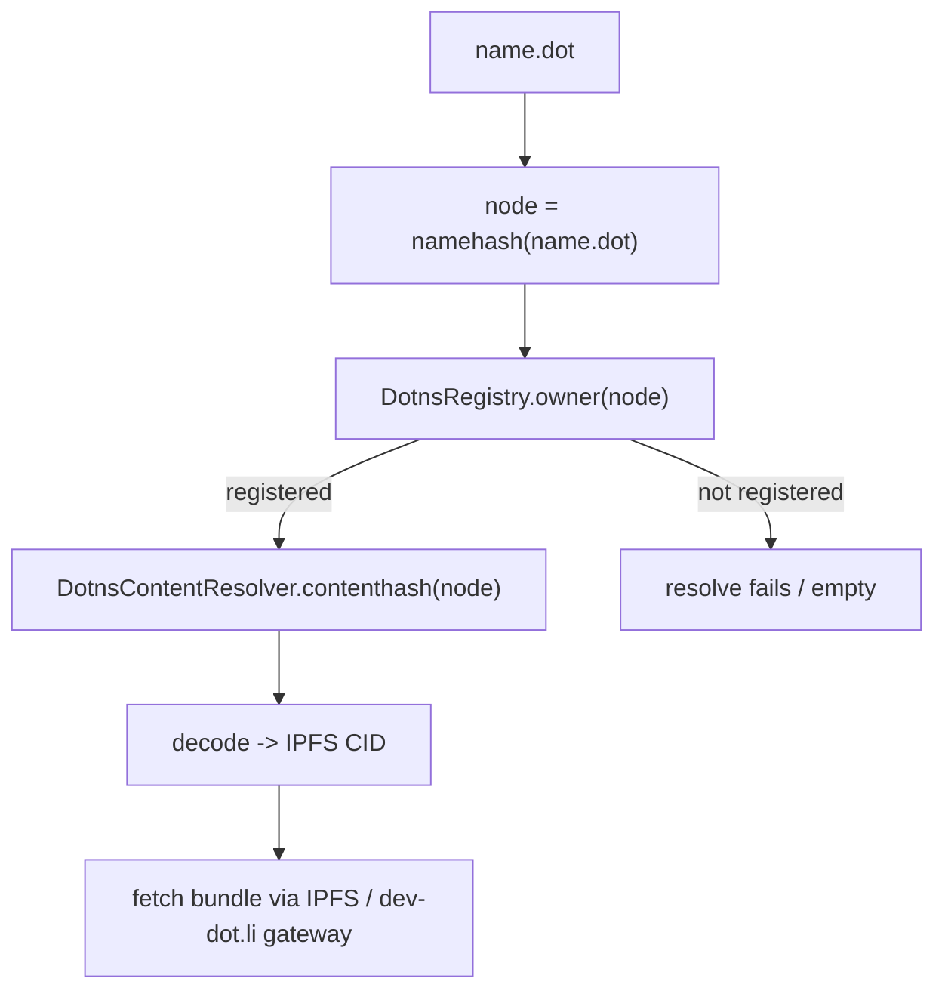

# Register a .dot domain

A `.dot` domain is a human-readable handle on the Polkadot Products Devnet. It maps to
an owner account and, optionally, to an application bundle — so that visiting
`your-app.dot` in the [Polkadot app](https://polkadotcommunity.foundation/desktop/)
or the [web gateway](https://dev-dot.li) loads your app.

You can register and manage names with the DotNS CLI (`@polkadot-community-foundation/dotns-cli`).
Short and reserved names have extra gates; ordinary app names follow the normal
registration path. The same reads and lookups are available from the
[DotNS reference UI](https://dotns.dev-dot.li).

!!! note
    This is a public developer preview. Devnet tokens have no real value, and flows
    may change. Never paste a real mainnet secret into a devnet tool.

## How naming works

DotNS is a set of PolkaVM (pallet-revive) contracts. A name such as `alice.dot` is
hashed to a *node* using ENS-style namehashing, an ERC-721 token records ownership,
and per-node resolvers hold the address, content, reverse, and personhood records.
Binding a name to an app means writing an IPFS content hash into the content resolver;
a client then reads that record and fetches the bundle from the network's IPFS / dev-dot.li
gateway.



For the full contract topology, see the [dotns](https://github.com/paritytech/dotns)
and [dotns-sdk](https://github.com/paritytech/dotns-sdk) repositories.

## Install the CLI

```bash
npm i -g @polkadot-community-foundation/dotns-cli
# provides the `dotns` command
```

Every command takes a network via `--env <network>` (or the `DOTNS_ENV` environment
variable). The concrete network name is provided by the team operating the network. The
examples below use `--env devnet`; substitute the value you were given.

The exact subcommands and flags shown below are indicative — run `dotns --help` (or
`dotns <command> --help`) for the current surface of the CLI you installed.

## Set up an account

The CLI signs with a per-account keystore. Store a mnemonic once, then reference it by
name:

```bash
# Encrypt and store a mnemonic (or key-uri) into the keystore
dotns auth set

# Confirm which account is active
dotns account address
dotns account info --env devnet
```

Registration signs a PolkaVM transaction, so your account needs a mapped EVM address
and a small devnet balance:

```bash
# Map your Substrate account to its EVM address (once per account)
dotns account map --env devnet

# Check whether an address is already mapped
dotns account is-mapped <address> --env devnet
```

If your account has no balance, request devnet funds from the
[faucet](https://faucet.polkadot.io).

## Reserved and short-name gating

Not every label is openly registrable. The public commit-reveal path enforces a
minimum label length of three characters, and labels are classified by their *stem*
(the label with trailing digits stripped):

- **Reserved** — stems of five characters or fewer are gated and cannot be claimed
  through the open path.
- **Personhood-gated** — six-to-eight-character stems require proof of personhood
  (a "lite" tier for a stem plus exactly two digits, a "full" tier for no digits).
- **Open** — stems of nine characters or more register without a personhood check.

Governance-reserved and explicitly reserved names are rejected by the controller.
Personhood-tier usernames are issued through the gateway path when you prove personhood
in the Polkadot app, not through the CLI commands below.

!!! tip
    If you just want a name for an app, pick a label with a stem of nine or more
    characters (for example `my-cool-app`) to stay on the open path and avoid the
    personhood gate.

## Register a name

Registration uses a commit-reveal handshake: you commit a hashed intent, wait a minimum
commitment age, then reveal and pay. The CLI orchestrates all three steps:

```bash
dotns register domain -n my-cool-app --env devnet
```

Useful options:

- `-r, --reverse` — also set this name as your account's reverse (primary) record.
- `--json` — emit machine-readable output.

If the process is interrupted between commit and reveal, resume it:

```bash
dotns register domain retry my-cool-app --env devnet
dotns register domain list --env devnet     # inspect cached commitments
```

Verify ownership:

```bash
dotns lookup owner-of my-cool-app --env devnet
dotns lookup name my-cool-app --env devnet    # full record view
```

## Bind a name to a bundle

Once you have deployed your app (see [Build & publish a dApp](build-and-publish.md)) you will have an
IPFS CID for the bundle. Write it into the content resolver to make the name resolve to
your app:

```bash
# Set the content hash (IPFS CID) for a name you own
dotns content set my-cool-app <cid> --env devnet

# Read it back
dotns content view my-cool-app --env devnet
```

After this, opening `my-cool-app.dot` in the Polkadot app or at
[dev-dot.li](https://dev-dot.li) resolves the name, decodes the content hash to the CID,
and fetches your bundle from the gateway.

## Manage a name

```bash
# Set one of your names as the primary (reverse) name for your account
dotns primary set my-cool-app --env devnet
dotns primary status --env devnet

# Transfer ownership to another address or label
dotns lookup transfer my-cool-app --to <address-or-label> --env devnet

# Create a subname under a name you own
dotns register subname --env devnet
```

## Learn more

- [dotns contracts](https://github.com/paritytech/dotns)
- [dotns-sdk — CLI and UI](https://github.com/paritytech/dotns-sdk)
- [@polkadot-community-foundation/dotns-cli on npm](https://www.npmjs.com/package/@polkadot-community-foundation/dotns-cli)
- [DotNS reference UI (devnet)](https://dotns.dev-dot.li)
- [Web gateway](https://dev-dot.li)
- [Polkadot developer docs](https://docs.polkadot.com)
