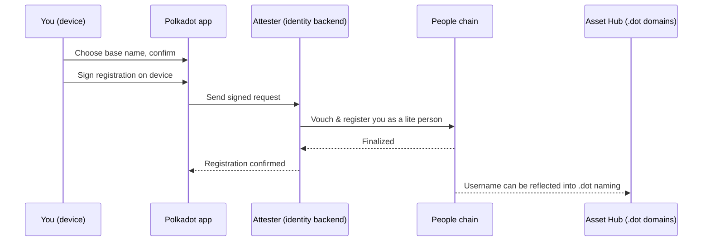

# Username & proof of personhood

Claim a human-readable **username** in the Polkadot app and understand the
**proof-of-personhood** tier attached to it. Some features, such as reserving
certain `.dot` domains or using apps that allow only one action per person, need
that signal before they can treat an account as a distinct human.

## What a username and personhood are

A **username** is a short, readable name that stands in for your account's long
technical address — easier to share and to recognise. When you claim one, the
app registers you on the People chain as a **lite person**.

**Personhood** is the network's way of expressing "this account belongs to a
distinct human", without exposing who you are. There are two tiers:

- **Lite** — earned by registering an attested username. This is the tier most
  users reach.
- **Full** — reached by redeeming an invitation, which provides stronger,
  one-account-per-human assurance.

Apps and smart contracts can read your tier through an on-chain interface and
adjust what they offer accordingly. In practice, an app only needs to know
whether you have no personhood, Lite personhood, or Full personhood.

!!! tip "Your privacy is preserved"
    When an app checks your personhood, it does not receive your identity. It
    receives a per-application **alias** — a pseudonym unique to that one app —
    so the same person cannot be tracked or linked across different apps.

## Before you start

You need an account with a small amount of devnet funds. If you have not set
one up yet, follow [Create an account & get funds](create-account.md) first.

Download links for the app are in
[Get the app](../reference/resources.md#get-the-app).

## Claim a username

1. Open the app and go to the profile or identity section, then choose to
   **claim a username**.
2. Enter a base name. The app validates it for you and will tell you if the
   name is unavailable or does not meet the network's formatting rules.
3. The app pairs your base name with a two-digit suffix (for example,
   `alicia.07`). The suffix `00` is never used, and the app skips digits that are
   already taken, so distinct people can share the same base name. Base names
   need at least six lowercase letters.
4. Confirm. The app signs the registration request **on your device** — your
   keys never leave it. It does not submit the registration directly: instead it
   sends the signed request to the network's attester service (the identity
   backend), which vouches for you and submits it to the People chain on your
   behalf.
5. The attester queues the request and submits it, so the username appears a few
   seconds after you confirm rather than instantly. Once it is on-chain you are a
   **lite person** and your username is live.

Behind the scenes, the app sends your signed request to the attester service,
which records your username on the People chain. Your username can also be
reflected into `.dot` naming so it works across app and discovery flows.

## Reach Full personhood (optional)

Full personhood is **invitation-gated**: the app redeems a one-time invitation
voucher, which then progresses your verification on-chain. Vouchers are not
self-service — the team distributes them directly, for example as a QR code at an
event. Without one, Lite is your tier.

That is the expected outcome, not a failure. Lite covers every user flow in these
guides; the only thing Full adds is claiming a six-to-eight-character `.dot` stem
with no digits (see
[Reserved and short-name gating](register-a-dot-name.md#reserved-and-short-name-gating)).

## Why some features need personhood

Personhood exists so that apps can offer **one-person-one-action** experiences
fairly — for example, a single vote, a single claim, or one entry per human —
rather than letting one user act many times from many accounts. Because apps
read your tier (and a privacy-preserving alias) directly from the chain, they
can enforce these limits without ever learning your identity.

Reserving a name can also be tied to your registration: claiming a username can
mirror it into `.dot` naming, through operator-run infrastructure rather than
your own transaction. To see whether yours was mirrored, search the name in the
[DotNS UI](https://dotns.dev-dot.li) — nothing else about your account depends on
it. Short names are the ones a tier unlocks; see
[Register a .dot domain](register-a-dot-name.md).

## If something blocks you

- **The name is unavailable.** Try another base name or accept the suffix the app
  proposes.
- **The registration does not finalize.** Check that your account has enough PAS
  for fees.
- **Full personhood is not offered.** Expected without an invitation voucher —
  Lite is the tier these guides assume.
- **An app does not recognize your status yet.** Wait for the on-chain update to
  finalize, then reopen the app.

## Learn more

- [Identity & personhood](../architecture/identity.md) — tiers, aliases, and the precompile
- [Register a .dot domain](register-a-dot-name.md) — what a tier unlocks
