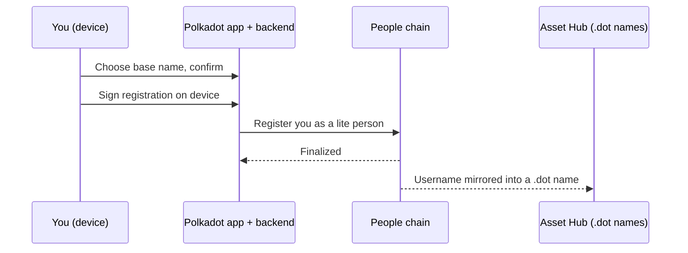

# Username & proof of personhood

Claim a human-readable **username** in the Polkadot app and understand the
**proof-of-personhood** tier attached to it. Some features, such as reserving
certain `.dot` names or using apps that allow only one action per person, need
that signal before they can treat an account as a distinct human.

!!! note "This is a devnet"
    The Polkadot Products Devnet is a public developer preview. Tokens here
    have no real value, and flows may change. Never reuse a recovery phrase from
    a real, value-bearing wallet on a devnet.

## What a username and personhood are

A **username** is a short, readable name that stands in for your account's long
technical address — easier to share and to recognise. When you claim one, the
app registers you on the People chain as a **lite person**.

**Personhood** is the network's way of expressing "this account belongs to a
distinct human", without exposing who you are. There are two tiers:

- **Lite** — earned by registering an attested username. This is the tier most
  users reach.
- **Full** — earned through the personhood "game" or by being invited, which
  provides stronger, one-account-per-human assurance.

Apps and smart contracts can read your tier through an on-chain interface and
adjust what they offer accordingly. The status values are defined as
`0 = None`, `1 = Lite`, `2 = Full`
([`IPersonhood.sol`](https://github.com/paritytech/individuality-community/blob/main/precompiles/personhood/sol/IPersonhood.sol)).

!!! tip "Your privacy is preserved"
    When an app checks your personhood, it does not receive your identity. It
    receives a per-application **alias** — a pseudonym unique to that one app —
    so the same person cannot be tracked or linked across different apps.

## Before you start

You need an account with a small amount of devnet funds. If you have not set
one up yet, follow [Create an account & get funds](create-account.md) first.

- Get the app: Android
  <https://play.google.com/store/apps/details?id=io.pcf.polkadotapp>,
  iOS <https://testflight.apple.com/join/VvC8SHVE>,
  Desktop <https://polkadotcommunity.foundation/desktop/>,
  or the web gateway <https://dev-dot.li>.

## Claim a username

1. Open the app and go to the profile or identity section, then choose to
   **claim a username**.
2. Enter a base name. The app validates it for you and will tell you if the
   name is unavailable or does not meet the network's formatting rules.
3. The app pairs your base name with a two-digit suffix (for example,
   `alice.07`). The suffix `00` is never used, and the app skips digits that are
   already taken, so distinct people can share the same base name.
4. Confirm. The app signs the registration request **on your device** — your
   keys never leave it — and submits it. Nothing is sent to a server to sign on
   your behalf.
5. Wait for the registration to finalize on-chain. Once it does, you are a
   **lite person** and your username is live.

Behind the scenes, the app's backend batches your registration onto the People
chain, and a separate watcher can mirror your username into a matching `.dot`
name so it resolves across the app.

## Reach Full personhood (optional)

Lite personhood is enough for everyday use. Some features may require **Full**
personhood, which you reach by taking part in the personhood game or by
redeeming an invitation. When you have an invitation, the app can request a
one-time ticket and use it on-chain to progress your verification. Availability
of the game and invitations depends on the network operator, so this step may
not be active at all times.

## Why some features need personhood

Personhood exists so that apps can offer **one-person-one-action** experiences
fairly — for example, a single vote, a single claim, or one entry per human —
rather than letting one user act many times from many accounts. Because apps
read your tier (and a privacy-preserving alias) directly from the chain, they
can enforce these limits without ever learning your identity.

Reserving a name is also tied to your registration: claiming your username is
what puts a matching `.dot` name in your name. More desirable or scarce names
may be gated behind a personhood tier, so completing this flow is what unlocks
them. To learn how naming works, see
[Register a .dot name](register-a-dot-name.md).

## Learn more

- [Identity & personhood architecture](../architecture/identity.md)
- [Naming (DotNS) architecture](../architecture/naming.md)
- [Register a .dot name](register-a-dot-name.md)
- Personhood pallets & precompile source: <https://github.com/paritytech/individuality-community>
- Identity backend source: <https://github.com/paritytech/identity-backend-community>
- Polkadot developer docs: <https://docs.polkadot.com>
