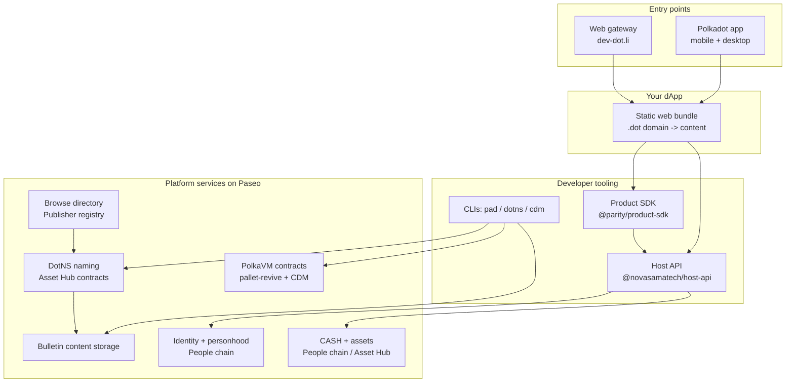

# Introduction

The **Polkadot Products Devnet** is a public developer preview of the Polkadot
app and the app platform behind it. These docs are here to help you do something
concrete first: install the app, create an account, try Products, build one of
your own, or understand how the platform fits together before reading source.

The larger idea is simple: Products should feel like polished web experiences,
while running on decentralized blockchain infrastructure. A Product can be named,
published, discovered, opened, and used through Polkadot-native services instead
of a traditional app server. The Polkadot app and web gateway provide the smooth
entry point, while the Devnet gives developers a place to test those web3 flows
end to end.

!!! warning "This is a public Devnet"
    The Polkadot Products Devnet is an early developer preview. Tokens on it have
    **no real value**, chains and services may be reset, and flows described here
    may change. Do not use it to hold anything of value, and expect rough edges.

## What you can do

For **users**, the Devnet is the Polkadot app: a self-custodial client for
mobile and desktop, with a web gateway at [dev-dot.li](https://dev-dot.li). You
can create an account, claim a human-readable username, try CASH flows, chat,
and use Products.

For **developers**, it is a way to ship a web Product into a Polkadot-native
host. You build a frontend, give it a `.dot` domain, publish the bundle, and use
host-provided services such as accounts, signing, identity, payments, contracts,
and storage.

Products are addressed by human-readable `.dot` domains. A name resolves to the
published bundle, and the bundle runs inside the Polkadot app or the web
gateway. The Product talks to the surrounding host through the **Host API**, so
the same experience can run across mobile, desktop, and web entry points without
asking users to manage raw keys, RPC endpoints, or chain-specific plumbing.

## The model to keep in your head

Four layers stack on top of each other. When you are blocked, first identify
which layer you are working in: the entry point, your Product, the developer
tools, or the platform services.



- **The Polkadot app** keeps keys on-device, runs Products in a sandbox, and
  exposes the Host API.
- **Your app** is a static web bundle addressed by a `.dot` domain.
- **The SDK and CLIs** help you build, name, publish, and connect a Product.
- **The platform services** provide naming, content storage, identity, money,
  contracts, and discovery.

## A tour of the pieces

### The network

The Devnet runs on the community-operated **Paseo** network: a relay chain plus
system parachains. App developers mainly target **Asset Hub** for contracts and
assets, **People** for identity and personhood, and **Bulletin** for published
app bundles. See [The network](architecture/network.md).

### The Polkadot app (client tier)

The native clients share one model: keys stay on-device, and Products run in a
sandboxed view that talks to the host for accounts, signing, permissions,
payments, chat, storage, and chain access. See
[The Polkadot app](architecture/client.md).

### Naming (DotNS)

DotNS is the `.dot` naming system. You use it to register a name and point that
name at your published Product bundle. See [Naming (DotNS)](architecture/naming.md).

### App delivery

The `@parity/polkadot-app-deploy` CLI (`pad`) publishes a built static bundle and
updates the `.dot` domain that should load it. The gateway then resolves the name
and renders the Product. See [App delivery](architecture/app-delivery.md).

### Smart contracts and CDM

Contracts run on PolkaVM through Asset Hub. The **Contract Dependency Manager**
(`@polkadot-community-foundation/cdm-cli`, `cdm`) helps you build, deploy, and
register contracts so downstream projects can install them by name. See
[Smart contracts & CDM](architecture/contracts.md).

### Identity and personhood

Identity spans a username system and proof-of-personhood tiers (Lite and Full) on
the People chain, readable by any contract through a personhood precompile. See
[Identity & personhood](architecture/identity.md).

### Money (CASH and funding)

"CASH" is the in-app display name for a Devnet digital-dollar asset, spent
through a privacy-preserving coin system. You get Devnet funds from the in-app
"Get CASH" flow or the external [faucet](https://faucet.polkadot.io). See
[Money (CASH & funding)](architecture/money.md).

### App discovery (Browse)

**Browse** is the app directory. A `Publisher` contract records which `.dot` apps
are listed; clients read that set and hydrate display metadata off-chain. See
[App discovery (Browse)](architecture/discovery.md).

## Steps for developers

The usual path is:

1. Build a static frontend with the Product SDK.
2. Register or choose a `.dot` domain.
3. Publish the built bundle with `pad`.
4. Add contracts with CDM only when your Product needs custom on-chain logic.

## The developer packages

The CLIs all target a network preset. For this Devnet, use `devnet`: `pad` and
`dotns` use `--env devnet`; CDM uses `-n devnet`.

```bash
# App development
npm i @parity/product-sdk          # typed platform access (chains, contracts, identity)
npm i @novasamatech/host-api        # the host <-> product transport protocol

# Command-line tooling
npm i -g @polkadot-community-foundation/dotns-cli          # register and manage .dot domains
npm i -g @parity/polkadot-app-deploy # bin: pad — package + publish a dApp
npm i -g @polkadot-community-foundation/cdm-cli            # bin: cdm — build, deploy, register contracts
npm i @polkadot-community-foundation/cdm-env               # resolve a network's contract registry
```

!!! note "Common blocker"
    The Product SDK routes all chain access through the host container, so it is
    designed to run inside the Polkadot app or the web gateway rather than as a
    standalone Node process. For automated end-to-end testing there is a thin test
    host that speaks the real protocol with auto-signed dev accounts.

## Start here

=== "I am a user"

    1. Install the app: [Android APK](https://get.polkadotcommunity.foundation/android/latest.apk),
       [iOS TestFlight](https://testflight.apple.com/join/VvC8SHVE), or
       [Desktop](https://polkadotcommunity.foundation/desktop/). You can also
       browse dApps in the web gateway at [dev-dot.li](https://dev-dot.li).
    2. Follow [Create an account & get funds](guides/create-account.md).
    3. Explore: [get and use CASH](guides/get-and-use-cash.md),
       [claim a username](guides/username-and-personhood.md), and
       [discover apps](guides/discover-and-open-apps.md).

=== "I am a developer"

    1. Read the [developer getting-started](getting-started/developers.md) page.
    2. Build and ship a dApp: [Build & publish a dApp](guides/build-and-publish.md)
       and [Register a .dot domain](guides/register-a-dot-name.md).
    3. Go deeper: [deploy contracts with CDM](guides/deploy-contracts-cdm.md),
       [use platform services from the SDK](guides/platform-services-sdk.md), and
       [list your app in Browse](guides/list-in-browse.md).

## What to expect from a preview network

- **No-value tokens.** Everything on the Devnet is for experimentation only.
- **Rough edges.** Services are operated by the community and may change or reset.
- **Operator-provided details.** The concrete `--env` network name and live chain
  endpoints are supplied by the team running the network; this documentation uses
  package names, contract shapes, and public URLs that are stable across those
  details.

## Learn more

- Reference apps: [Browse](https://browse.dev-dot.li),
  [DotNS UI](https://dotns.dev-dot.li),
  [Playground](https://playground.dev-dot.li),
  [Simple Survey](https://survey.dev-dot.li),
  [Mercado](https://mercado.dev-dot.li),
  [localdot](https://localmarket.dev-dot.li),
  [CDM Frontend](https://contracts.dev-dot.li)
- Source: [github.com/paritytech](https://github.com/paritytech)
- Packages: [@parity/product-sdk](https://www.npmjs.com/package/@parity/product-sdk),
  [@novasamatech/host-api](https://www.npmjs.com/package/@novasamatech/host-api),
  [@parity/polkadot-app-deploy](https://www.npmjs.com/package/@parity/polkadot-app-deploy),
  [@polkadot-community-foundation/dotns-cli](https://www.npmjs.com/package/@polkadot-community-foundation/dotns-cli),
  [@polkadot-community-foundation/cdm-cli](https://www.npmjs.com/package/@polkadot-community-foundation/cdm-cli)
- Official Polkadot developer docs: [docs.polkadot.com](https://docs.polkadot.com)
