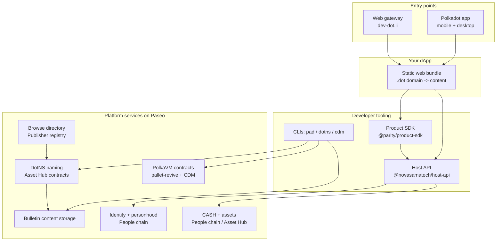

# Introduction

The **Polkadot Products Devnet** is a public developer preview of the Polkadot
app and the platform behind it. It exists so you can do something concrete:
install the app, try Products other people built, and ship one of your own.

The idea is simple. Products should feel like polished web experiences while
running on decentralized infrastructure. A Product is named, published,
discovered, opened, and used through Polkadot-native services instead of a
traditional app server — no app store, no backend to operate, no server sitting
between a user and your app.

## What you can do

For **users**, the Devnet is the Polkadot app: a self-custodial client for
mobile and desktop, plus a web gateway at [dev-dot.li](https://dev-dot.li).
Create an account, claim a username, try CASH flows, chat, and open Products.

For **developers**, it is a way to ship a web app into a Polkadot-native host.
You build a static frontend, give it a `.dot` domain, publish the bundle, and
call host-provided services for accounts, signing, identity, payments,
contracts, and storage.

Products are addressed by human-readable `.dot` domains. A name resolves to a
published bundle, and the bundle runs inside the Polkadot app or the web
gateway. Your Product talks to the surrounding host through the **Host API**, so
the same code runs across mobile, desktop, and web without asking users to
manage raw keys, RPC endpoints, or chain-specific plumbing.

## The model to keep in your head

Four layers stack on top of each other. When you get stuck, first work out which
layer you are in: the entry point, your Product, the developer tools, or the
platform services.

- **The Polkadot app** keeps keys on-device, runs Products in a sandbox, and
  exposes the Host API.
- **Your app** is a static web bundle addressed by a `.dot` domain.
- **The SDK and CLIs** build, name, publish, and connect a Product.
- **The platform services** provide naming, storage, identity, money, contracts,
  and discovery.

For how each piece actually works — and the full path of a request from a `.dot`
name to chain storage and back — read the
[architecture overview](architecture/index.md).

## Ship one

The developer loop is four steps, and only the first three are required:

1. Build a static frontend with the Product SDK.
2. Register a `.dot` domain.
3. Publish the bundle with `pad`.
4. Add contracts with CDM when your Product needs custom on-chain logic.

Pick where to start:

<a class="intro-cta__card intro-cta__card--user" href="../getting-started/users/">
  
    <svg width="20" height="20" viewBox="0 0 24 24" fill="none" stroke="currentColor" stroke-width="2" stroke-linecap="round" stroke-linejoin="round"><circle cx="12" cy="12" r="9"/><path d="m15.5 8.5-2 5-5 2 2-5 5-2Z"/></svg>
    For users
  
  Start using the app
  Install the Polkadot app, claim a username, and enjoy a decentralized web experience.
  Get the app &rarr;
</a>

<a class="intro-cta__card intro-cta__card--dev" href="../getting-started/developers/">
  
    <svg width="20" height="20" viewBox="0 0 24 24" fill="none" stroke="currentColor" stroke-width="2" stroke-linecap="round" stroke-linejoin="round"><path d="m8 6-6 6 6 6M16 6l6 6-6 6"/></svg>
    For developers
  
  Start building
  Ship an application to a <code>.dot</code> site, create new decentralized experiences.
  Read the dev guide &rarr;
</a>

