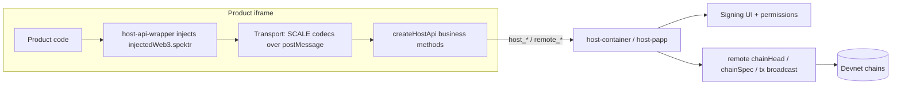

# Packages & tools

Use this page when you are setting up a Product project and need to know which
SDK, CLI, or helper package belongs in your workflow. The short version is:
install the Product SDK for app code, use the Host API when you need to speak
directly to the Polkadot app host, and use the CLIs to register names, publish
bundles, and manage contracts.

!!! note
    This is a public developer preview. Package versions, published names, and
    the concrete network you target may change. Never put a mnemonic, seed
    phrase, or private key into a command line or config file that could be
    committed.

## Developer packages

Most projects only need a few direct dependencies:

| Package | Install | Purpose | Bin |
|---------|---------|---------|-----|
| [`@parity/product-sdk`](https://www.npmjs.com/package/@parity/product-sdk) | `npm i @parity/product-sdk` | TypeScript SDK for building apps: multi-chain access, transactions, signing, contract calls, cloud storage, and identity. | — |
| [`@novasamatech/host-api`](https://www.npmjs.com/package/@novasamatech/host-api) | `npm i @novasamatech/host-api` | Host↔product transport protocol and typed business methods used by apps running inside the Polkadot app. | — |
| [`@polkadot-community-foundation/dotns-cli`](https://www.npmjs.com/package/@polkadot-community-foundation/dotns-cli) | `npm i -g @polkadot-community-foundation/dotns-cli` | CLI for the `.dot` naming system: register names, set content/address records, manage reverse names and stores. | `dotns` |
| [`@parity/polkadot-app-deploy`](https://www.npmjs.com/package/@parity/polkadot-app-deploy) | `npm i -g @parity/polkadot-app-deploy` | Deploy CLI: uploads a built static bundle to Bulletin, binds it to a `.dot` domain, and optionally lists it. | `pad` |
| [`@polkadot-community-foundation/cdm-cli`](https://www.npmjs.com/package/@polkadot-community-foundation/cdm-cli) | `npm i -g @polkadot-community-foundation/cdm-cli` | Contract Dependency Manager: build, deploy, publish, register, and install PolkaVM contracts. | `cdm` |
| [`@polkadot-community-foundation/cdm-env`](https://www.npmjs.com/package/@polkadot-community-foundation/cdm-env) | `npm i @polkadot-community-foundation/cdm-env` | Maps a network name to its Asset Hub / Bulletin RPCs, IPFS gateway, and CDM registry address. | — |

!!! tip
    The CLIs all select a network preset. For this Devnet, use `devnet`:
    `pad` and `dotns` use `--env devnet`; CDM uses `-n devnet`. If a command
    fails because a preset cannot be found, check that the tool is up to date
    before trying other names.

## Product SDK family

`@parity/product-sdk` is the main dependency for Product app code. It gives an
app access to wallet, storage, chain, contract, and identity services through
the surrounding host: the Polkadot app or the web gateway. That host boundary is
intentional. Product apps should not manage private keys or build their own
wallet layer.

| Package | Purpose |
|---------|---------|
| `@parity/product-sdk` | Main SDK entry point for Product apps. |
| `@parity/product-sdk-chain-client` | Typed access to the Devnet chains. |
| `@parity/product-sdk-descriptors` | Chain descriptors used by the SDK. |
| `@parity/product-sdk-signer` | Host-backed signing, plus development signers for tests. |
| `@parity/product-sdk-contracts` | Contract calls and ABI handling for PolkaVM contracts. |
| `@parity/product-sdk-cloud-storage` | Bulletin-backed content storage helpers. |
| `@parity/product-sdk-host` | Host detection and host-provided services. |

These packages are versioned together in the
[Product SDK monorepo](https://github.com/paritytech/product-sdk) and are usually
pulled in through `@parity/product-sdk` rather than installed one by one.

## Host API packages

Apps that run inside the Polkadot app talk to the host through the Host API.
Use this when you need lower-level control over host communication, or when you
are testing how your app behaves inside the real host protocol.

| Package | Install | Purpose |
|---------|---------|---------|
| [`@novasamatech/host-api`](https://www.npmjs.com/package/@novasamatech/host-api) | `npm i @novasamatech/host-api` | Typed host methods for accounts, signing, storage, chat, payments, and remote chain access. |
| [`@novasamatech/host-api-wrapper`](https://www.npmjs.com/package/@novasamatech/host-api-wrapper) | `npm i @novasamatech/host-api-wrapper` | Product-side runtime that connects a web app to the host bridge. |
| [`@parity/host-api-test-sdk`](https://www.npmjs.com/package/@parity/host-api-test-sdk) | `pnpm add -D @parity/host-api-test-sdk` | Test host for end-to-end tests without launching the full app. |



The host-side stack and shared libraries live in the
[triangle-js-sdks](https://github.com/paritytech/triangle-js-sdks) monorepo.

## Command-line tools

| CLI | Package | Bin | What it does |
|-----|---------|-----|--------------|
| Deploy | `@parity/polkadot-app-deploy` | `pad` | Publishes a built static bundle, stores it on Bulletin, and points a `.dot` domain at it. |
| DotNS | `@polkadot-community-foundation/dotns-cli` | `dotns` | Registers and manages `.dot` domains: `register`, `lookup`, `content`, `primary`, `transfer`, `store`, `pop`, and more. |
| CDM | `@polkadot-community-foundation/cdm-cli` | `cdm` | Builds, deploys, publishes, and registers PolkaVM contracts. |

A typical deploy invocation binds a built bundle to a name on a chosen network:

```bash
pad ./dist my-app.dot --env devnet
```

!!! warning
    The deploy account must already hold a live Bulletin storage authorization —
    `pad` never self-authorizes and fails fast if the authorization is missing or
    expired. Authorizations are granted by the network's authorizer, an operator
    action.

### CDM libraries

The `cdm` CLI is built on shared libraries that apps and other tools can reuse:

| Package | Install | Purpose |
|---------|---------|---------|
| [`@polkadot-community-foundation/cdm-env`](https://www.npmjs.com/package/@polkadot-community-foundation/cdm-env) | `npm i @polkadot-community-foundation/cdm-env` | Resolves a network name to registry and endpoint information. |
| `@parity/cdm-builder` | `npm i @parity/cdm-builder` | Shared build, deploy, publish, and install pipeline. |
| [`@parity/product-sdk-contracts`](https://www.npmjs.com/package/@parity/product-sdk-contracts) | `npm i @parity/product-sdk-contracts` | Runtime contract resolution and ABI use from Product apps. |

## End-user entry points

These are the applications end users install, not developer packages, but they
are the environment your app runs in.

| Entry point | Link |
|-------------|------|
| Polkadot app — Android APK | <https://get.polkadotcommunity.foundation/android/latest.apk> |
| Polkadot app — iOS TestFlight | <https://testflight.apple.com/join/VvC8SHVE> |
| Polkadot app — Desktop | <https://polkadotcommunity.foundation/desktop/> |
| Web gateway | <https://dev-dot.li> |
| Devnet faucet | <https://faucet.polkadot.io> |

## Reference apps

Working examples deployed on the Devnet. They double as usage references for
the packages above.

| App | URL |
|-----|-----|
| Browse (app directory) | <https://browse.dev-dot.li> |
| DotNS UI | <https://dotns.dev-dot.li> |
| CDM Frontend | <https://contracts.dev-dot.li> |
| Playground template | <https://playground-template.dev-dot.li> |
| Playground | <https://playground.dev-dot.li> |
| Simple Survey | <https://survey.dev-dot.li> |
| Mercado (marketplace) | <https://mercado.dev-dot.li> |
| localdot (local marketplace) | <https://localmarket.dev-dot.li> |

## Source repositories

Use source repositories when you need implementation detail that is too specific
for this reference page. Product and tooling repositories are linked under
`paritytech`; app client repositories keep their app-specific source links.

## Learn more

- Product SDK source: <https://github.com/paritytech/product-sdk>
- Host API / host-side source (triangle-js-sdks): <https://github.com/paritytech/triangle-js-sdks>
- Test host source (host-api-test-sdk): <https://github.com/paritytech/host-api-test-sdk>
- DotNS contracts and SDK: <https://github.com/paritytech/dotns> · <https://github.com/paritytech/dotns-sdk>
- Deploy CLI source: <https://github.com/paritytech/polkadot-app-deploy>
- CDM source: <https://github.com/paritytech/contract-dependency-manager>
- npm: [`@parity/product-sdk`](https://www.npmjs.com/package/@parity/product-sdk) · [`@novasamatech/host-api`](https://www.npmjs.com/package/@novasamatech/host-api) · [`@polkadot-community-foundation/dotns-cli`](https://www.npmjs.com/package/@polkadot-community-foundation/dotns-cli) · [`@parity/polkadot-app-deploy`](https://www.npmjs.com/package/@parity/polkadot-app-deploy) · [`@polkadot-community-foundation/cdm-cli`](https://www.npmjs.com/package/@polkadot-community-foundation/cdm-cli) · [`@polkadot-community-foundation/cdm-env`](https://www.npmjs.com/package/@polkadot-community-foundation/cdm-env)
- Official Polkadot developer docs: <https://docs.polkadot.com>
