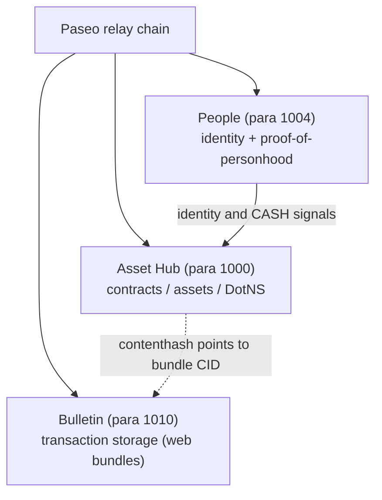
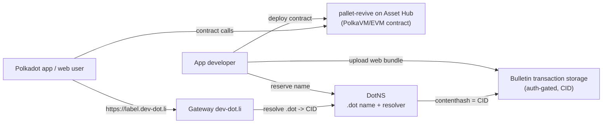

# The network

The Polkadot Products Devnet is a public developer preview that runs on the
community-operated **Paseo** network: a Paseo relay chain plus a set of system
parachains. Applications are built against three of those chains — **Asset Hub**,
**People**, and **Bulletin**. This page maps what each chain is responsible for
and how they fit together when a Product is deployed and opened.

!!! note
    This is a devnet. Tokens have no real value, and flows may still change.
    Never paste secrets (mnemonics, seed phrases, private keys) into any tool or
    page.

## Topology

The relay chain is the root of trust. Product flows mostly touch three system
parachains: **Asset Hub** for contracts and assets, **People** for identity and
money flows, and **Bulletin** for web-app bundle storage.

| Chain | Para ID | Role |
| --- | --- | --- |
| Relay | — | Root of trust; anchors the system parachains |
| Asset Hub | 1000 | Contracts (PolkaVM/EVM), assets, DotNS gateway |
| People | 1004 | Identity and proof-of-personhood |
| Bulletin | 1010 | Web-app content storage |

## Asset Hub (para 1000)

Asset Hub is the primary chain for Product developers. It carries the contract,
asset, and naming machinery used by deployed apps.

### pallet-revive (PolkaVM contracts)

`pallet-revive` provides the PolkaVM smart-contract environment. CDM, DotNS, and
application contracts run here.

### Assets suite and ERC-20 precompiles

Asset Hub exposes on-chain assets to contracts through ERC-20-style precompiles,
so Product contracts can read and transfer supported assets without learning
Substrate storage details.

### DotNS gateway

The DotNS gateway connects `.dot` names to the contract environment. For how
names resolve to app bundles, see [Naming](./naming.md).

### Personhood precompile

Contracts on Asset Hub can read proof-of-personhood through a precompile. That
lets apps ask for a user's personhood tier without calling the identity backend.

## People (para 1004)

The People chain holds identity, proof-of-personhood, and Coinage state. It is
where usernames are attested, personhood status is recorded, and CASH is held
and sent through Coinage.

## Bulletin (para 1010)

The Bulletin chain stores published web-app bundles that the gateway serves.

!!! note
    Bulletin uploads are **authorization-based, not fee-based**. Rather than
    charging tokens per upload, storage is gated by an authorizer (Root, sibling
    parachains, or registered authorizers). This is why publishing an app bundle
    does not consume devnet tokens.

## The deployments register

Concrete addresses, endpoints, and CIDs for a given deployment are recorded in the
[`summit-net-deployments`](https://github.com/paritytech/summit-net-deployments)
register, not hard-coded in this documentation. Treat that register, plus the
tooling address books, as the source of truth for live Devnet addresses.

Command-line tools select a network preset (`--env <network>` for `pad` and
`dotns`, `-n/--name <network>` for CDM); the concrete name for a given
deployment is provided by the team operating that network. Read addresses and
CIDs from the register files rather than assuming them.

## Deploy and serve flow

The three chains combine into a single application lifecycle:

A developer deploys contracts to Asset Hub via `pallet-revive`, reserves a `.dot`
name through the DotNS gateway, and uploads the web bundle to Bulletin. The name's
contenthash resolver is bound to the bundle's CID, and the gateway at
[https://dev-dot.li](https://dev-dot.li) serves the app at `https://<label>.dev-dot.li`.
For how contracts and naming fit together, see the
[contracts](./contracts.md) and [naming](./naming.md) architecture pages, and the
[developer guides](../guides/index.md).

## Learn more

- [paseo-network/runtimes — chain runtimes](https://github.com/paseo-network/runtimes)
- [summit-net-deployments — deployments register](https://github.com/paritytech/summit-net-deployments)
- [pallet-revive (contracts / PolkaVM)](https://github.com/paritytech/polkadot-sdk/tree/master/substrate/frame/revive)
- [pallet-assets ERC-20 precompiles](https://github.com/paritytech/polkadot-sdk/tree/master/substrate/frame/assets/precompiles)
- [Polkadot developer documentation](https://docs.polkadot.com)
- [Web gateway (public developer preview)](https://dev-dot.li)
